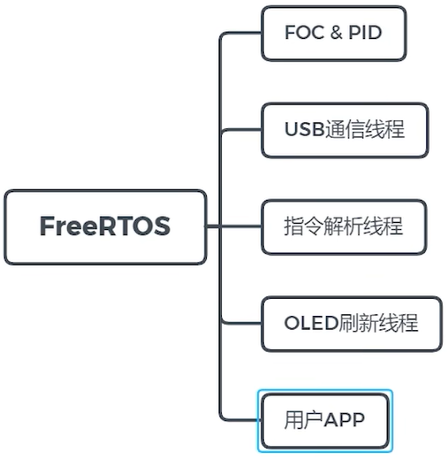
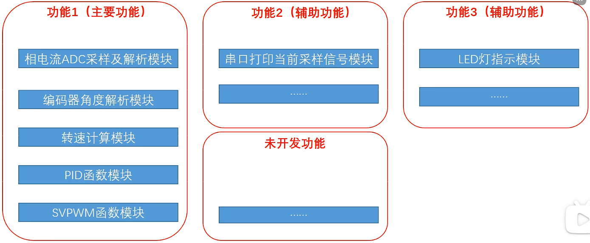

[【自制】机器人的心脏--超迷你FOC矢量控制驱动器【软核】_哔哩哔哩_bilibili](https://www.bilibili.com/video/BV11V41127pq/?spm_id_from=333.1387.upload.video_card.click&vd_source=b6cd6dd41c0769968f58ce886d249f74)

 

[【16、FOC软件(终章)】FOC软件设计，嵌入式操作系统freeRTOS_哔哩哔哩_bilibili](https://www.bilibili.com/video/BV1WB4y1y7aQ?spm_id_from=333.788.videopod.sections&vd_source=b6cd6dd41c0769968f58ce886d249f74)

 

# FreeRTOS+电机FOC+上位机 流程图

* 系统上电/复位
* 硬件初始化阶段
  * MCU内核初始化：时钟、中断、SysTick
  * 外设初始化：GPIO、TIM、ADC、DMA、编码器、EtherCAT从站芯片
  * 驱动层初始化：PWM关闭、ADC使能、EtherCAT从站复位
  * 硬件故障检测：过流、过压，故障则停机
* FreeRTOS初始化阶段
  * FreeRTOS内核初始化
  * 创建组件：队列（电机参数）、信号量（ADC DMA完成）、互斥量（全局控制参数）
  * 创建任务
  * 启动FreeRTOS调度器
* EtherCAT总线初始化
  * 加载从站配置（ESI文件）
  * DC同步初始化
  * 与主站建立通信：主站扫描从站，赋地址，配置PDO、SDO映射
  * 主站下发初始化参数（默认控制模式、PID参数）
* 离线任务执行阶段（支持跳过，只在第一次上电执行，或通过上位机强制执行）
  * 读取FLASH数据，判断电机/PID参数是否有效
  * 若无效，执行离线参数辨识（Rs可用直流注入法、Ld和Lq可用脉冲电压注入法、Ke可用空载测速法）、三环PID参数整定（临界比例度法），存FLASH，跳转到参数有效
  * 若有效，加载数据
* 正常运行阶段（中断、任务调度、上位机交互）
  * 硬件中断：PWM触发-->ADC DMA 完成中断-->唤醒电流环任务-->速度环任务-->位置环任务
  * EtherCAT PDO数据更新中断：唤醒PDO处理任务-->解析主站指令，更新全局控制参数-->传递给控制任务
  * EtherCAT SDO任务：响应主站参数配置/查询指令
  * 状态回传：通过PDO/SDO上传电机状态参数给主站
  * 故障处理：本地故障-->通过EtherCAT 上报主站，主站下发故障处理指令

参考：

[达妙科技: 产品资料](https://gitee.com/kit-miao/damiao)

[PocketServo](https://github.com/coinlockerbaby/PocketServo)
