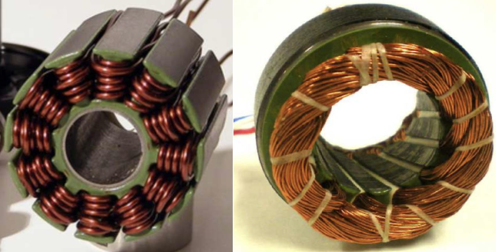
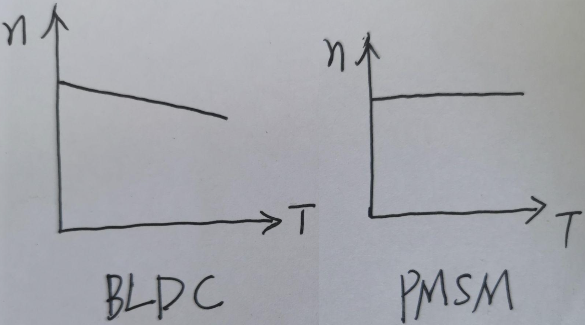

从结构、控制、应用上对比BLDC与PMSM的区别

BLDC 直流无刷电机、电子换向直流电机

PMSM 永磁同步电机

1、电机结构

集中整距绕组不一定是BLDC，分布短距绕组大概率是PMSM

BLDC、PMSM都是永磁电机，反电势 (运动的磁场会在导体中产生感应电流，进而产生感应电压，即感应电动势，也叫反电势) 是永磁电机很重要的一个指标，永磁体在电机转动时，会在定子绕组里产生反电势。不同的定子绕组结构会产生不同波形的反电势，目前主流的有两种，梯形波，正弦波。

完美的梯形波很难造就出来，大多数反电势波形是介于梯形波与正弦波之间。分布短距绕组更容易制造正弦波，集中整距绕组一般是不完美的正弦波。有时为了减少齿槽转矩的影响，使用斜极、斜槽的设计，使得反电势波形更趋于正弦波。

因为集中整距绕组在工艺制造上，相对更容易，所以对要求不高的BLDC，一般用集中整距绕组来做定子就可以了。

因为集中绕组端部轴向尺寸小，提高了铜的利用率（端部铜线不产生电磁功率），所以集中绕组的电机一般效率较高（铜损降低了）。并不是BLDC效率高。

集中式绕组：每个定子齿被缠绕；分布式绕组：至少两个定子齿被缠绕

 

磁钢形状，弧形、瓦片形、抛物线形、面包形都是永磁同步电机中常用的磁钢形状。

转子的结构，表贴式SM-PMSM、内置式I-PMSM都是永磁同步电机中常用的转子结构。

2、电机控制

BLDC的输入是直流电源，借助电子换向器 (简易版逆变器) ，使得输入定子绕组的是电压大小不变，正负方向变化的交流电源。采用六步换相控制，电机旋转一圈是360°，每60度切换一次，磁场角度永远在60度-90度-120度-60度，做往复运动，电磁拉力也一直在从小到大，再从大到小变化。所以BLDC的转矩脉动比较大。因为控制简单，所以BLDC使用霍尔传感器，反馈换相时的角度，电子换向器切换电源方向即可。

PMSM的输入是交流电源，可用家电50Hz的正弦波电源。是用正弦波的三相旋转交流电源 (三相交流电，波形为正弦波) 来控制，在定子中产生一个旋转磁场，推动转子旋转。只要三相电源稳定，那么输出的转矩就是稳定的。所以PMSM的转矩脉动就小很多。(因为电源逆变过程中会产生谐波，由谐波会产生一些脉动)。PMSM需要知道转子的准确位置，随时调整电流来调整转矩，保证转速同步，所以需要相对高端的旋转变压器来测速定位。

转矩脉动的成因主要有：齿槽转矩引起、电磁转矩产生原理引起、电流换相引起

3、电机应用

BLDC本质是直流电机，对于开环控制，负载与转速T-n曲线是斜的，转速会随着负载增大而降低。

BLDC速度公式：n=U/Ce∮-TR/CeCt∮2

PMSM本质是同步电机，转速只与电机极对数和电源频率有关，与负载大小没有直接关系，所以PMSM的控制精度高。

失步现象：如果负载转矩超过堵转转矩，转子转速跟不上旋转磁场转速，转子转速会降低，直到停止。在大型永磁同步电机或同步发电机中，会在转子表面加阻尼绕组，在转子失步时，有转差率，产生感应电流，类似异步电机原理，驱动转子旋转，跟上旋转磁场转速。

PMSM速度公式：n=60f/p

两者的负载曲线如下：

 

| 驱动(↓)\反电势(→) | 梯形波        | 正弦波          |
| ----------------- | ------------- | --------------- |
| 方形波            | BLDC (理想化) | BLDC (实际应用) |
| 正弦波            | /             | PMSM            |

**BLDC与PMSM之间没有明显的界定，大多数电机应用都是根据具体的应用需求，匹配合适的电机特性，取长补短。**

BLDC可以用FOC控制，能减小转矩脉动，其相电流也会更接近正弦波，但由于其反电动势不是正弦波，所以他的控制效果肯定不如PMSM，却因此丢失了BLDC成本低的优势。BLDC与PMSM的基本构造相似，原料成本相差不大，但FOC的控制成本高。所以往往BLDC采用集中整距绕组，用六步换相控制，应用于受转矩脉动影响小的场合；而PMSM采用分布短距绕组，用FOC控制，用于需要精确控制的场合。

[彻底搞懂BLDC与PMSM的区别 - 知乎](https://zhuanlan.zhihu.com/p/513442224)

[BLDC(无刷直流电机)和PMSM(永磁同步电机)的区别-CSDN博客](https://blog.csdn.net/weixin_41469013/article/details/133722827)