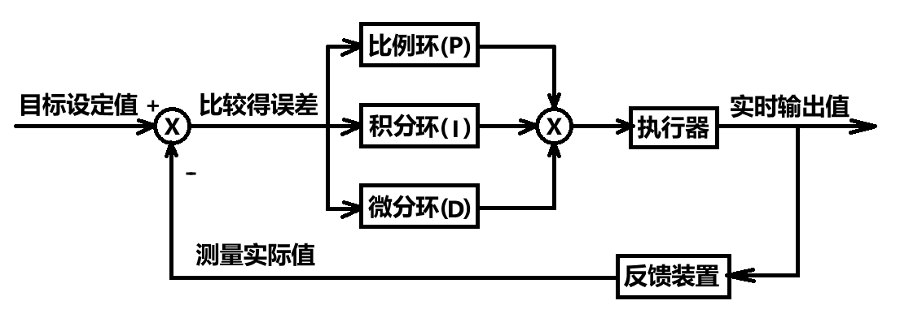

PID控制器

 

# 比例环Proportion

成比例地反应控制系统的偏差信号，即输入与输出偏差成正比，可用来减小系统的偏差。

$u = K_p * e$

$u$ ——输出

$K_p$ ——比例系数 **(调节作用快，系统一出现偏差，调节器立即将偏差放大输出)**

$e$ ——偏差

**静态误差**：系统控制过程趋于稳定时，目标值与实测值之间的偏差

产生静差的原因：输出u的作用被外部影响抵消

若外部影响已知，就可通过调整Kp来抵消静差

但实际上，偏差e是实时变化的，不能确定偏差的大小，把Kp设置太大，就会使系统产生超调和振荡，导致系统稳定性变差

1、Kp越大，系统响应越快，越快达到目标值

2、Kp过大，会使系统产生较大的超调和振荡，导致系统稳定性变差

3、仅有比例环节无法消除静态误差

# 积分环Integral

对偏差e进行积分，只要存在偏差，积分环就会不断起作用，主要用于**消除静态误差**，提高系统的无差度。

$u = K_p * e + K_i * \sum e$

$u$ ——输出

$K_i$ ——积分系数 **(改变输入偏差对系统输出的影响程度)**

$\sum e$ ——累计偏差

当系统偏差为0时，达到目标值，此时累计偏差不再变化达到最大值，但积分环仍在作用（此时往往作用最大），易造成超调现象。需引

入微分环，提前减弱输出，抑制超调的发生。

1、Ki越大，消除静态误差的时间越短，越快达到目标值

2、Ki过大，会使系统产生较大的超调和振荡，导致系统的稳定性变差

3、对于惯性较大的系统，积分环节动态响应较差，容易产生超调和振荡

# 微分环Differential

反应偏差量的变化趋势，根据**偏差的变化量**提前做出相应控制，减小超调，克服振荡。

PID离散公式

1、位置式（全量式）PID公式：

$u_k = K_p * e_k + K_i * \sum_{j=0}^k * e_j + K_d * (e_k - e_{k-1})$     （1）

​    a、uk直接对应对象的输出（位置），如果计算出现异常，对系统的影响很大

​    b、全量计算（需全部控制量参与，每一次输出都和过去的状态有关），对偏差e进行累加，计算量大

​    c、在不带积分部件的对象中可得到很好的效果，适用电液伺服阀、温控设备

2、增量式PID公式：

令 k=k-1 代入 （1）：

​     $u_{k-1} = K_p * e_{k-1} + K_i * \sum_{j=0}^{k-1} * e_j + K_d * (e_{k-1} - e_{k-2})$     （2）

由 （1）-（2）得：

​     $\Delta u_k =k_p * (e_k - e_{k-1}) + K_i * e_k + K_d * (e_k -2* e_{k-1} + e_{k-2})$     （3）

​    a、增量式PID公式计算的是先对于上次输出的增量，即 $u_k = u_{k-1} + \Delta u_k$ 

​    b、增量只与近3次的偏差有关，计算出现异常，对系统的影响较小

​    c、计算量小，实时性相对较好

​    d、适用于自身带积分部件的对象

$u_k$ ——第k次输出

$e_k$ ——第k次偏差

$e_{k-1}$ ——第k-1次偏差

$\sum_{j=0}^k * e_j$ ——累计k次偏差

$K_d$ ——微分系数  **(偏差变化量对系统输出的影响程度，Kd越大，系统对偏差量的变化越敏感，越能提前响应，进而抑制超调，Kd过大会让系统出现振荡)**

1、Kd或变化趋势越大，微分环节作用越强，对超调和振荡的抑制作用越强

2、Kd过大会引起系统的不稳定，容易引起高频噪音

在实际应用中，并不是每一个系统都需要PID的三个环节参与控制，有的系统只需要比例环节或积分环节就可很好的控制

每一个系统的PID参数并不是通用的，需根据实际情况去设置

