# MC SDK 电机库软件框架说明

## 软件整体框架

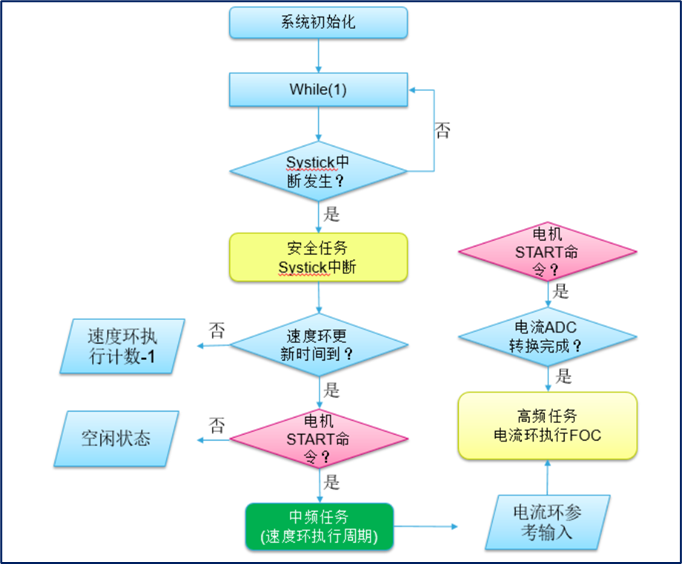 

**两大中断、三大任务**：

ADC转换完成中断

Systick中断

高频任务

安全任务

中频任务

## main函数

系统初始化

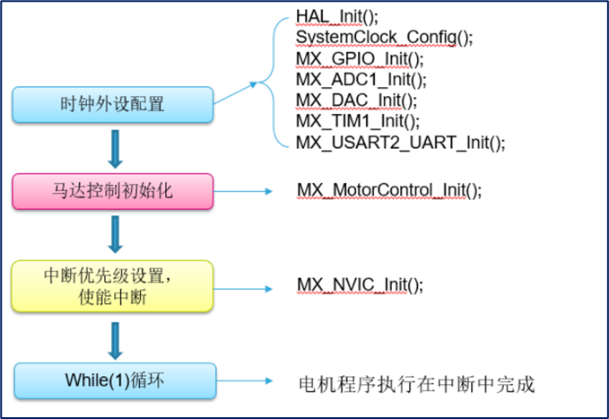 

## Systick中断

周期：默认为500us

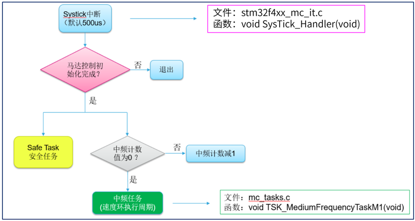 

执行安全任务、中频任务

### 安全任务

周期： 500us

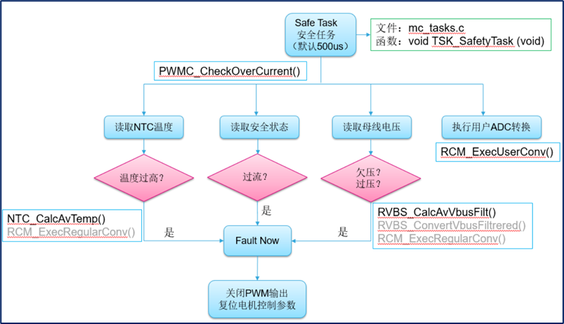 

执行过温、过流、欠/过压保护，若触发上诉保护则关闭PWM输出，复位电机参数

### 中频任务

周期： n*500us (n=1,2,3,...)

比如设定速度环执行周期为2ms，则中断计数值为4，4\*500ns=2ms，即四次Systick中断后执行一次中频任务

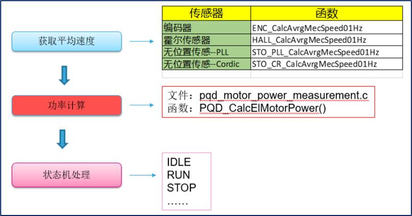 

执行速度环、状态机操作，将速度环的输出作为电流环的输入、功率计算等

## ADC转换完成中断

周期：TIM1通道4的周期

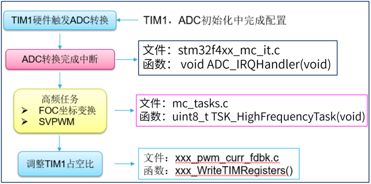 

TIM1通道4触发ADC转换

void MX_ADC1_Init(void) : 

sConfigInjected.InjectedChannel = ADC_CHANNEL_8; 

sConfigInjected.ExternalTrigInjecConv = ADC_EXTERNALTRIGINJECCONV_T1_CC4; 

### 高频任务

FOC核心算法

周期：PWM周期

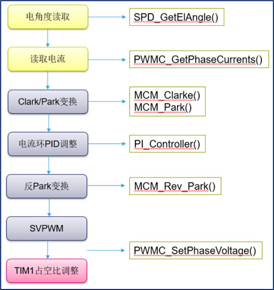 

# MotorControlWorkbench配置

## 新建电机控制板

位置：Tools工具--BoardDesigner电路板设计工程师--Create new board创建新的电路板

本软件中带星号的参数，均为必填项

### 1、Board电路板

>  Select type of board选择电路板的类型

(1)、Control控制组件

> 只有主控部分

(2)、Bridge桥接组件

> 用于连接控制组件和功率组件

(3)、Power功率组件

> 只有驱动部分

(4)、Inverter控制板 (逆变器)

> 包括控制组件和功率组件

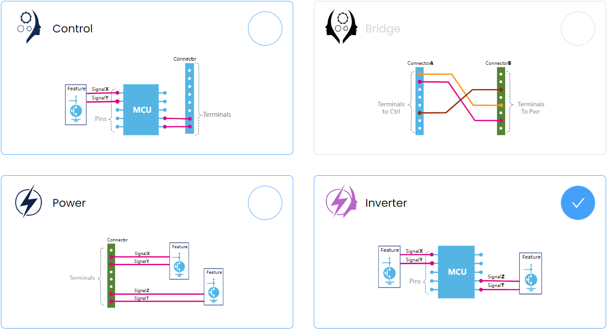 

> feature功能元件
>
> connector连接器
>
> terminal端子

Next下一步

### 2、Mandatory fields必填项

> It will not be possible to continue if the mandatory fields have not been set如未填写必填项，则无法继续

(1)、Name：

> name of board电路板名称

(2)、PN：

> part number of the board电路板的零件编号

(3)、Version版本：

> (可自动填写)

(4)、Algorithm compatibility算法兼容性：

> FOC、sixStep (可不选)

(5)、MCU :

> MCU hosted on the board板载微控制单元

(6)、Clock Source 时钟源：

> Internal RC Oscillator内部电阻电容振荡器；
>
> xxMHz External Crystal外部晶体(振荡器)

(7)、Clock Frequency时钟频率

> (自动算出)

Next下一步

### 3、Motor Features / Feature电机特性

> Add components of board添加电路板组件

在Motor Features下，选择Add Motor Feature，添加多个电机

在M1下填写Specifications规格、Features特性，选择Add Features，可添加多个特性

> 1、当Algorithm compatibility算法兼容性不选时，默认有三个必须的Features特性：CurrentSensing电流采样、SpeedAndPositionSensing速度和位置检测、PhaseVoltageGeneration相电压生成
>
> 2、当Algorithm compatibility算法兼容性选择FOC时，默认有两个必须的Features特性：CurrentSensing电流采样、PhaseVoltageGeneration相电压生成
>
> 3、当Algorithm compatibility算法兼容性选择sixStep时，默认有两个必须的Features特性：SpeedAndPositionSensing速度和位置检测、PhaseVoltageGeneration相电压生成
>
> 4、当Algorithm compatibility算法兼容性选择FOC、sixStep时，默认有三个必须的Features特性：CurrentSensing电流采样、SpeedAndPositionSensing速度和位置检测、PhaseVoltageGeneration相电压生成

 

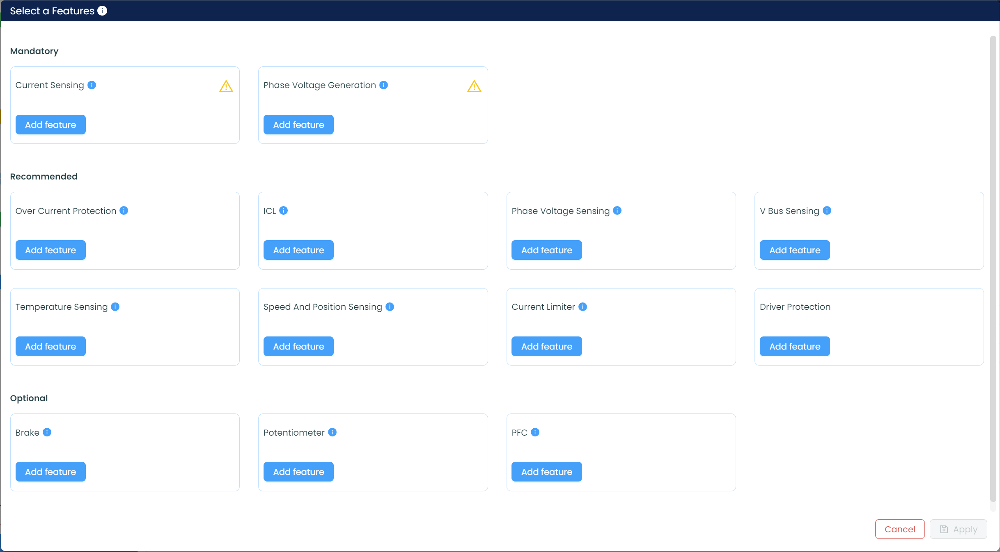 

> mandatory必须的
>
> recommended推荐的
>
> optional可选的

#### 3.1、Specifications规格

(1)、Name：

> Name that uniquely identify the instance of the Motor Feature on the board.板载电机特性实例的唯一标识名称

(2)、Min Rated Voltage：

> Min rated voltage, Volts最低额定电压，单位：V

(3)、Max Rated Voltage：

> Max rated voltage, Volts最高额定电压，单位：V

(4)、Max Rated Current：

> 最高额定电流，单位：A

Max Rated Power (最高额定功率，单位：W)：

Resistor Offset (电阻补偿值，单位：V)：

> Resistance added by the electronics of the board to that of the motor at the measurement point. The value of the resistorOffset is subtracted from the raw motor resistance measurement made by the profiler. Then, the actual motor resistance is obtained with the following formula: Rs = (Rmeasure - offsetResistor)/2 where Rs is the phase resistance of the motor and Rmeasure the raw measurement made by the profiler firmware.
>
> 由电路板电子元件在测量点为电机电阻附加的补偿电阻值。分析器固件测得原始电机电阻后，需从中减去电阻补偿值（resistorOffset），最终通过以下公式计算电机实际相电阻：
>
> Rs = (Rmeasure - offsetResistor)/2
>
> 其中：
>
> Rs：电机相电阻
>
> Rmeasure：分析器固件的原始测量值
>
> 本软件中该参数单位是V，表示用电压表示电阻？使用该参数时需注意

#### 3.2、PhaseVoltageGeneration相电压生成

(1)、Driver Name：

> Driver or IGBT or MOSFET name驱动器/开关器件名称
>
> 例：IR2184

> IGBT , Insulated Gate Bipolar Transistor , 绝缘栅双极型晶体管
>
> MOSFET , Metal-Oxide-Semiconductor Field-Effect Transistor , 金属氧化物半导体场效应晶体管

(2)、Driver PN：

> Driver or IGBT or MOSFET Part Number驱动器/开关器件型号
>
> 例：FGA25N120ANTD

(3)、TNoise：

> TNoise parameter of the switches. In ns开关器件的噪声时间参数，单位：ns

> 描述开关过程中的瞬态噪声持续时间
>
> 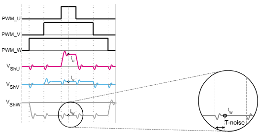 
>
> IGBT驱动器型号（Driver PN）需与开关噪声时间参数（TNoise）匹配，以避免高频振荡

(4)、Min Dead Time：

> Min dead-time, in ns最小死区时间，单位：ns

> 防止桥臂直通的最小间隔时间
>
> 需大于开关器件的最小死区时间（Min Dead Time），通常设置为最小值的1.2~1.5倍

(5)、Max Switching Freq：

> Max switching frequency, in KHz最大开关频率，单位：KHz

> 开关器件允许的最高工作频率

.1、Hardware Variants硬件变体

> A Hardware Variant is a specific hardware implementation of a feature available on a board. A board can implement several different hardware variants for a given feature.
>
> 指电路板上某一功能的特定硬件实现方式。对于同一功能，同一块电路板可集成多种不同的硬件变体。

..1、Driving topology驱动拓扑结构

...1、High and Low Sides高低边全驱动

> Description描述：
>
> Both the high and low side power switches that connect each phase of the motor to Vbus and the ground need to be driven by the MCU
>
> MCU需直接驱动连接电机各相到 **Vbus（母线电压）** 的高边功率开关，以及连接各相到 **地（GND）** 的低边功率开关
>
> 每相需两个PWM信号（高边+低边） → 三相共 6个驱动信号

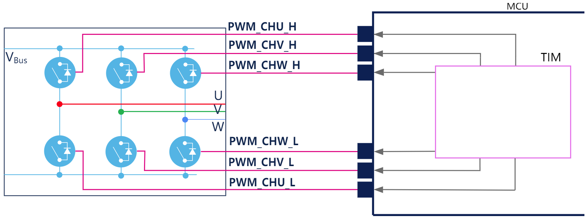 

...1.1、Master Enable主使能信号 (控制整体开关状态)

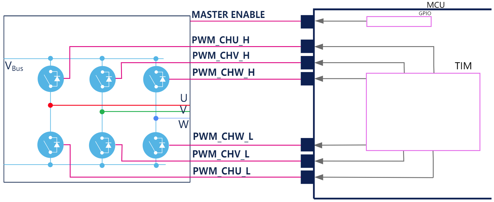 

 ...2、High sides and Enables高边驱动+使能控制

...2.1、One Enable单使能

1个总使能信号 + 3个高边PWM信号 → 共 4个信号

> Description描述：
>
> Only the high side switches that connect each phase of the motor to Vbus need to be driven by the MCU. The low side switches that connect each phase of the motor to the ground are automatically handled by the driver on the power stage. Additionally, the driving of all phases is subject to an enable signal. This results in four signals exchanged between the power stage and the MCU: one signal that enables the driving of the phases and three signals to actually drive each phase. The three high side signals must be connected to the TIM_CH1 (phase U), TIM_CH2 (phase V) and TIM_CH3 (phase W) pins of the same timer. This Timer peripheral must be the same for the three signals and it must provide the PWM feature. The enable signal can be connected to any GPIO of the MCU.
>
> MCU仅驱动高边功率开关，低边开关由功率级（Power Stage）的驱动芯片自动控制。各相驱动需通过 使能信号（Enable）统一激活。高边PWM信号必须连接至同一定时器的 **TIM_CH1（U相）、TIM_CH2（V相）、TIM_CH3（W相）** 引脚。定时器需支持 **PWM功能**，且三个通道必须隶属于同一定时器外设。使能信号可连接至MCU任意GPIO引脚。

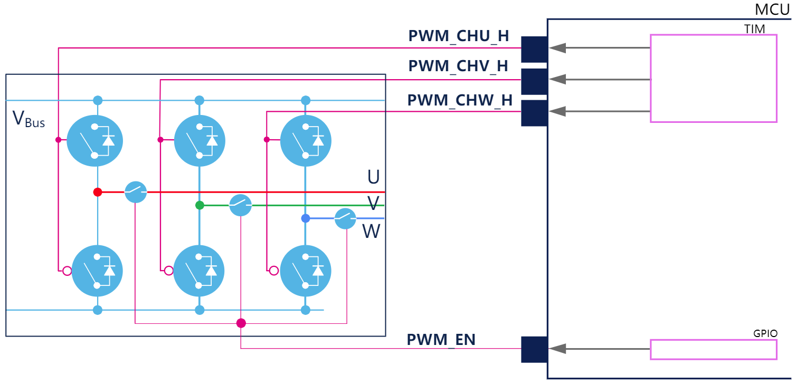 

...2.2、Three Enables三使能

3个独立使能信号 + 3个高边PWM信号 → 共 6个信号

> Description描述:
>
> Only the high-side switches that connect each phase of the motor to Vbus need to be driven by the MCU. The low-side switches that connect each phase of the motor to the ground are automatically handled by the driver on the power stage. Additionally, the driving of each phase is subject to an enable signal. This results in six signals exchanged between the power stage and the MCU: three signals that enable the driving of each phase and three signals to drive each phase. The three high-side signals must be connected to the TIM_CH1 (phase U), TIM_CH2 (phase V), and TIM_CH3 (phase W) pins of the same timer. This timer peripheral must be the same for the three signals and it must provide the PWM feature.
>
> 仅需由MCU驱动连接电机各相至电源总线（Vbus）的**高边开关**。连接电机各相至地的**低边开关**由功率级上的驱动器自动控制。此外，各相的驱动需受**使能信号**控制。因此，功率级与MCU之间需交换六路信号：三路用于使能各相驱动的**使能信号**；三路用于驱动各相的**驱动信号**。**三路高边驱动信号**必须连接至同一定时器的以下引脚：**TIM_CH1**（对应U相）、**TIM_CH2**（对应V相）、**TIM_CH3**（对应W相）。三路信号必须使用**同一定时器外设**，该定时器需支持**PWM功能**。

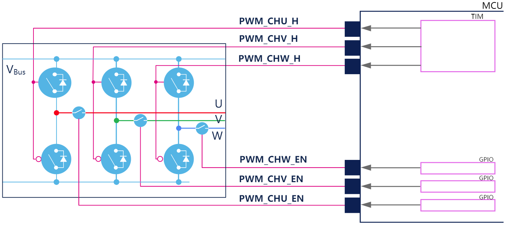 

建议高精度控制场景使用 High and Low Sides高低边全驱动，低成本设计优先 High sides and Enables高边驱动+使能控制。

(1)、Dead Time死区时间

> Dead time to insert when switching highsides and low sides
>
> 上下桥臂开关切换时插入的延迟时间（单位：纳秒），用于防止直通短路（Shoot-Through）。

(2)、High Side Switches Driving Polarity高边开关驱动极性

> Polarity of the driving signals for the high side switches. Possible values are: - Active low - Active high
>
> 高边驱动信号极性。可选值：低电平有效 / 高电平有效

(3)、Low Side Switches Driving Polarity低边开关驱动极性

> Polarity of the driving signals for the low side switches. Possible values are: - Active low - Active high
>
> 低边驱动信号极性。可选值：低电平有效 / 高电平有效

(4)、Enable Driving Polarity

> Polarity of the enable signals. Possible values are: - Active low - Active high
>
> 使能信号极性。可选值：低电平有效 / 高电平有效

(5)、Signals信号

> Signals are the physical interface provided by the hardware variant with the MCU. The signals defined by a hardware variant of a feature are directly connected to the pin of the MCU.
>
> 信号为硬件变体与MCU间的物理接口，**由功能硬件变体定义的信号直接连接至MCU引脚**。

Complexity复杂度

> A non negative number that measures how 'difficult' is to use the hardware variant. 0 means nothing to do. Non-zero value means how is difficult make a changes on the board (es. jumper to move, solder bridge to close or to open, a 0-Ohm resistor to solder or unsolder...). This field is optional if a description is not present.
>
> 一个非负数，用于量化特定硬件变体的使用难度。0表示无需任何硬件调整（即插即用）。非零值表示需要修改电路板的操作复杂度（例如：移动跳线、闭合/断开焊桥、焊接/移除0欧姆电阻等），数值越大表示操作越复杂。若未提供相关操作说明，此字段可省略。

#### 3.3、CurrentSensing电流采样

(1)、T-rise (TRise parameter of the switches. In ns开关上升时间参数，单位：ns)：

>  

.1、Hardware Variants硬件变体

..1、Current topology电流拓扑结构

...1、Single Shunt Resistor单分流电阻

...1.1、Amplification放大 -> Internal OpAmps内部运算放大器

...1.2、Sensing Type检测类型 : Single Ended单端

...1.3、Gain Type增益类型 -> Extenal gain net外部增益网络

> Description描述:
>
> One shunt resistor is used to measure phase currents (two measurements are made at different instants of the PWM period to get all currents). This hardware variant does not amplify the voltage measured across the shunt but it offsets it by a positive shift voltage. It also provides the electronics needed to build the gain of the opamp used for the amplification of the current measurement. The variant provides three signals among which CURRENT_SHUNT_P that carries the potential on the high side of the shunt resistor offset by the shift voltage. This first signal is used to compute the values of the currents flowing through the phases of the motor. The two others connect the amplifying opamp to the amplification gain circuitry provided by the hardware variant. The signals coming out of the hardware variant are meant to be connected to an opamp peripheral embedded in the MCU. This opamps is configured in single-ended mode and the amplification gain is built outside of the MCU, in the hardware variant. the opamp non-inverting input is connected to the CURRENT_SHUNT_P signal, its inverting input is connected to the CURRENT_AMPLN signal and its output is connected to the CURRENT_AMPL signal.
>
> 使用一个分流电阻来测量相电流（在PWM周期的不同时刻进行两次测量以获取所有电流）。该硬件变体不会放大分流电阻两端的测量电压，而是通过正偏移电压对其进行电平移位。它还提供构建运放增益所需的电子元件，用于电流测量的放大。该变体提供三个信号，其中CURRENT_SHUNT_P信号承载经偏移电压电平移位后的分流电阻高端电位。此第一信号用于计算流过电机各相的电流值。其余两个信号将放大运放连接到硬件变体提供的放大增益电路。从硬件变体输出的信号需连接至MCU内置的运放外设。该运放配置为单端模式，放大增益在MCU外部的硬件变体中构建。运放同相输入端连接CURRENT_SHUNT_P信号，反相输入端连接CURRENT_AMPLN信号，输出端连接CURRENT_AMPL信号。

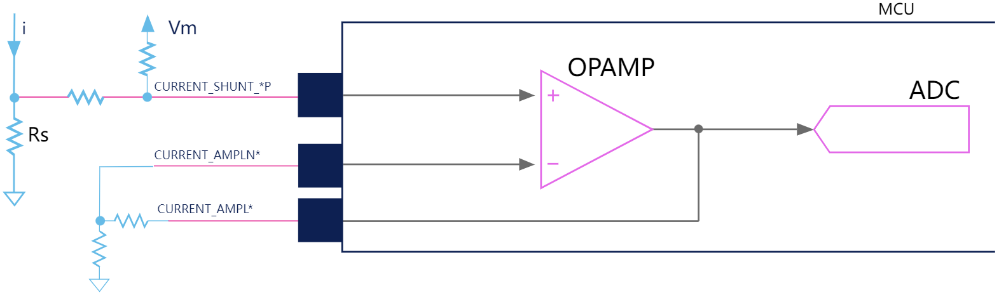 

...1.3、Gain Type增益类型 -> Internal PGA内部PGA

> Description描述:
>
> One shunt resistor is used to measure phase currents (two measurements are made at different instants of the PWM period to get all currents). This hardware variant does not amplify the voltage measured across the shunt, but it offsets it by a positive shift voltage. The variant provides one signal CURRENT_SHUNT_P that carries the potential on the high side of the shunt resistor offset by the shift voltage. This signal is used to compute the values of the currents flowing through the phases of the motor. The signal coming out of the hardware variant is meant to be connected to an opamp peripheral embedded in the MCU. This opamps is configured in single-ended mode and the amplification gain is made in the MCU using the PGA. The opamp non-inverting input is connected to the CURRENT_SHUNT_P signal. The voltage measured between the potential carried by this signal and the ground of the MCU is amplified by the opamp and then fed into an ADC embedded in the MCU
>
> 使用一个分流电阻测量相电流（在PWM周期的不同时刻进行两次测量以获取所有电流）。该硬件变体不会放大分流电阻两端的测量电压，而是通过正偏移电压进行电平移位。该变体提供一个CURRENT_SHUNT_P信号，该信号承载经偏移电压电平移位后的分流电阻高端电位。此信号用于计算流过电机各相的电流值。从硬件变体输出的信号需连接至MCU内置的运放外设。该运放配置为单端模式，放大增益通过MCU内部的PGA实现。运放同相输入端连接CURRENT_SHUNT_P信号。该信号电位与MCU地之间的测量电压经运放放大后，送入MCU内置的ADC。

 

...1.1、Amplification放大 -> External opAmps外部运放

> Description描述:
>
> One shunt resistor is used to measure phase currents (measurements are made at different instants of the PWM period to get all currents) and the inverter amplifies the voltage measured across the shunt. The signal coming out of the power stage is connected to an ADC on the MCU. The ADC is in single-ended mode and the signal carries the potential on the high side of the shunt resistor, which is then compared to the ground of the MCU.
>
> 使用一个分流电阻来测量相电流（在PWM周期的不同时刻进行测量以获取所有电流），并通过逆变器对分流电阻两端的测量电压进行放大。从功率级输出的信号直接连接至MCU的模数转换器（ADC）。ADC工作于单端模式，信号携带分流电阻高端的电位，该电位随后将与MCU的地电位进行比较。

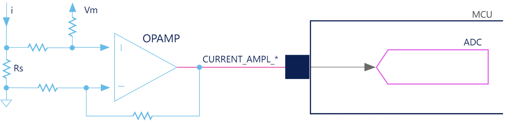 

...1.1.1、No Offset无偏移

> Description描述:
>
> One shunt resistor is used to measure phase currents and the inverter board amplifies the voltage measured across the shunt. However, the current is always positive, so there is no offset circuitry to level it up. The signal coming out of the power stage is connected to an ADC on the MCU. The ADC is in single-ended mode and the signal carries the potential on the high side of the shunt resistor, which is then compared to the ground of the MCU.
>
> 使用一个分流电阻测量相电流，逆变器板对分流电阻两端的电压进行放大。由于电流始终为正值，因此无需偏移电路进行电平提升。从功率级输出的信号直接连接至MCU的ADC。ADC工作于单端模式，信号携带分流电阻高端电位，该电位将与MCU地电位进行比较。

 

...2、Three Shunt Resistor

...2.1、Amplification放大 -> Internal OpAmps内部运算放大器

...2.2、Sensing Type检测类型 : Differential差分

...2.3、Gain Type增益类型 -> Extenal gain net外部增益网络

> Description描述:
>
> Three shunt resistors are used to measure phase currents (one per phase). The circuitry on the inverter does not amplify the voltages measured across the shunts. It only provides the offset network. The six current signals (that carry the potential on the high- and low-sides of each shunt resistor) must be connected to the OpAmp peripherals on the MCU. The OpAmps are in differential mode and three signals carry the potential on the high side of each shunt resistor to the noninverting inputs while three others carry that of the low sides to the inverting inputs. The inverter provides the current signal offset circuitry and external resistors to make the OpAmp gain. So, MCU pins are used for OpAmp noninverting and inverting inputs and OpAmp outputs.
>
> 使用三个**分流电阻**（每相一个）测量相电流。逆变器板上的电路**不放大**分流电阻两端的电压，仅提供**偏移网络**。六个电流信号（分别对应各分流电阻的高端与低端电位）需连接至MCU的**运算放大器（OpAmp）外设**。运放工作在差分模式，三路信号携带各分流电阻**高端电位** → 连接至运放**同相输入端（+）**，三路信号携带各分流电阻**低端电位** → 连接至运放**反相输入端（-）**。逆变器板提供**偏移电路**与**外部电阻网络**，共同构建运放增益。MCU专用引脚用于接收运放同相/反相输入信号，运放输出信号通过指定引脚回传至MCU内部ADC。

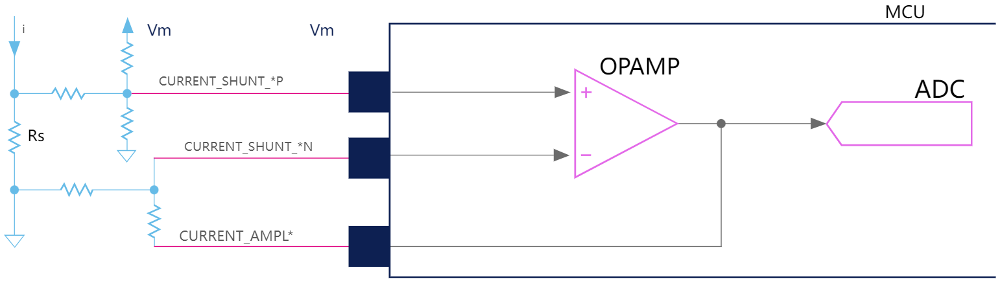 

...2.3.1、Filtered ADC Input带滤波的ADC输入通道

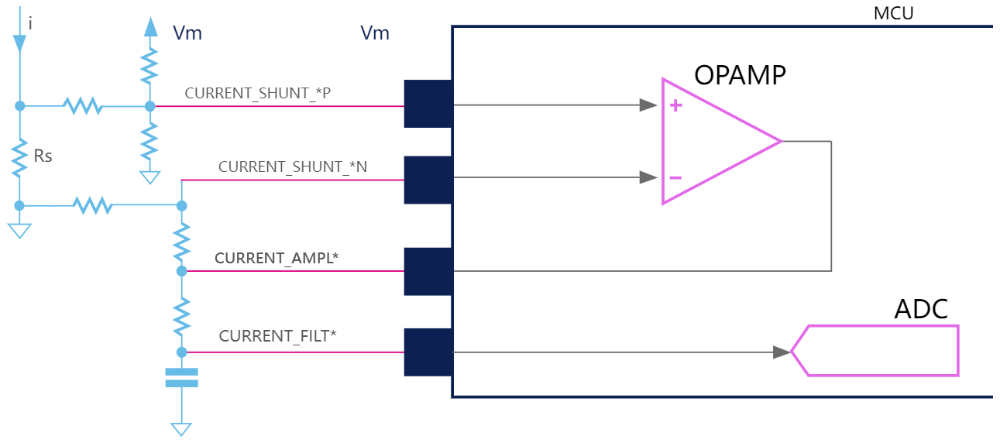 

...2.3、Gain Type增益类型 -> Internal PGA内部PGA

> Description描述:
>
> Three shunt resistors are used to measure phase currents (one per phase). The circuitry on the inverter does not amplify the voltages measured across the shunts. It only provides the offset network. The six current signals (that carry the potential on the high- and low-sides of each shunt resistor) must be connected to OpAmp peripherals on the MCU. The OpAmps are in differential mode. The three signals that carry the potential on the high side of the shunt resistors go to the noninverting inputs; the three others, that carry the potential on the low sides of the shunts go to the inverting inputs. The inverter provides the current signal offset circuitry and the OpAmp gain is made internally. So, MCU pins are used for OpAmp noninverting and inverting inputs.
>
> 使用三个**分流电阻**（每相一个）测量相电流。逆变器板上的电路**不放大**分流电阻两端的电压，仅提供**偏移网络**。六个电流信号（分别对应各分流电阻的高端与低端电位）需连接至MCU的**运算放大器（OpAmp）外设**。运放工作在差分模式。**同相输入端（+）**：连接分流电阻**高端电位**（共三路信号）；**反相输入端（-）**：连接分流电阻**低端电位**（共三路信号）。逆变器板提供**偏移电路**，用于电平抬升，运放增益由MCU内部电路实现（如可编程增益放大器PGA）。MCU引脚用于OpAmp同相输入（+），OpAmp反相输入（-）。
>
> 偏移网络功能：将分流电阻两端的负向电压偏移至运放输入范围（例如：将-2V~+2V偏移至0~3.3V）；典型电路：电阻分压网络 + 基准电压源（如VREF = 1.65V）
>
> 差分电压计算：
>
> $V_{diff}=V_{high−side}−V_{low−side}=I_{phase}×R_{shunt}$ 
>
> 其中：$R_{shunt}$ ：分流电阻阻值 (如0.5mΩ)
>
> 运放输出关系：
>
> $V_{out}=(V_{high−side}−V_{low−side})×Gain+V_{offset}$
>
> 其中：$Gain$ ：MCU内部设定的运放增益（如20倍）；$V_{offset}$ 偏移网络提供的基准电压（如1.65V）

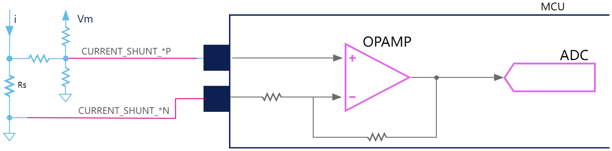 

...2.2、Sensing Type检测类型 : Single Ended单端

...2.3、Gain Type增益类型 -> Extenal gain net外部增益网络

> Description描述:
>
> Three shunt resistors are used to measure phase currents (one per phase). The circuitry on the inverter does not amplify the voltages measured across the shunts but it offsets them by a positive shift voltage. The variant provides nine signals among which CURRENT_SHUNT_UP, CURRENT_SHUNT_VP, and CURRENT_SHUNT_WP, that carry the potential on the high side of each shunt resistor offset by the shift voltage. These three first signals are used to compute the values of the currents flowing through the phases of the motor. The six other signals connect the amplifying OpAmps to the amplification gain circuitry provided by the hardware variant. The signals coming out of the hardware variant are meant to be connected to OpAmp peripherals embedded in the MCU. The OpAmps are configured in single-ended mode and their gain is built outside of the MCU, in the hardware variant. The OpAmps noninverting inputs are connected to the three shifted current signals CURRENT_SHUNT_UP, CURRENT_SHUNT_VP, and CURRENT_SHUNT_WP. Their inverting inputs are connected to the CURRENT_AMPLN_U, CURRENT_AMPLN_V and CURRENT_AMPLN_W signals; their outputs are connected to the CURRENT_AMPL_U, CURRENT_AMPL_V and CURRENT_AMPL_W signals
>
> 三个分流电阻被用于测量电机各相电流(每相一个)。逆变器上的电路不会放大分流电阻两端的测量电压，而是会叠加一个正值的偏移电压。该硬件变体提供了九个信号，其中包括CURRENT_SHUNT_UP、CURRENT_SHUNT_VP和CURRENT_SHUNT_WP——这三个信号承载了经过偏移电压调整后的各相分流电阻高端电位，将被用于计算流经电机各相的电流值。另外六个信号则用于连接运算放大器与硬件变体提供的增益调节电路。从硬件变体输出的信号需连接到微控制器(MCU)内嵌的运算放大器外设。这些运算放大器配置为单端工作模式，其增益由MCU外部的硬件变体电路实现。具体而言，运放的同相输入端分别连接三个经偏移调整的电流信号CURRENT_SHUNT_UP、CURRENT_SHUNT_VP和CURRENT_SHUNT_WP；反相输入端则对应连接CURRENT_AMPLN_U、CURRENT_AMPLN_V和CURRENT_AMPLN_W信号；运放的输出端最终产生CURRENT_AMPL_U、CURRENT_AMPL_V和CURRENT_AMPL_W信号。

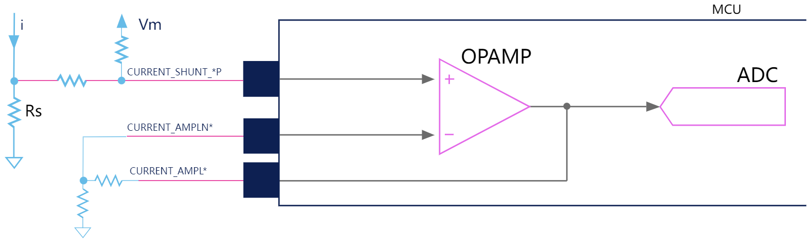 

...2.3、Gain Type增益类型 -> Internal PGA内部PGA

> Description描述:
>
> Three shunt resistors are used to measure phase currents (one per phase). The circuitry on the inverter does not amplify the voltages measured across the shunts but it offsets them by a positive shift voltage. The variant provides three signals CURRENT_SHUNT_UP, CURRENT_SHUNT_VP, and CURRENT_SHUNT_WP that carry the potential on the high side of each shunt resistor offset by the shift voltage. These signals are used to compute the values of the currents flowing through the phases of the motor. The signals coming out of the hardware variant are meant to be connected to OpAmp peripherals embedded in the MCU. These OpAmps are configured in single-ended mode and the amplification gain is made in the MCU using the PGA. OpAmps noninverting inputs are connected to the three CURRENT_SHUNT_UP, CURRENT_SHUNT_VP and CURRENT_SHUNT_WP signals. The voltages measured between the potential carried by these signals and the ground of the MCU are amplified by the OpAmps and then fed into ADCs embedded in the MCU.
>
> 三个分流电阻用于测量相电流（每相一个）。逆变器上的电路不会放大测得分流电阻两端的电压，而是通过一个正的偏移电压对它们进行偏移。该硬件变体提供了三个信号CURRENT_SHUNT_UP、CURRENT_SHUNT_VP和CURRENT_SHUNT_WP，这些信号携带了每个分流电阻高端电位经过偏移电压调整后的电平。这些信号被用于计算流经电机各相的电流值。
>
> 从硬件变体输出的信号需要连接到微控制器（MCU）内嵌的运算放大器（OpAmp）外设。这些运算放大器被配置为单端模式，其放大增益通过MCU内部的可编程增益放大器（PGA）实现。运算放大器的同相输入端分别连接至三个CURRENT_SHUNT_UP、CURRENT_SHUNT_VP和CURRENT_SHUNT_WP信号。测得的这些信号与MCU地之间的电压经过运算放大器放大后，将被送入MCU内嵌的模数转换器（ADC）进行采样。

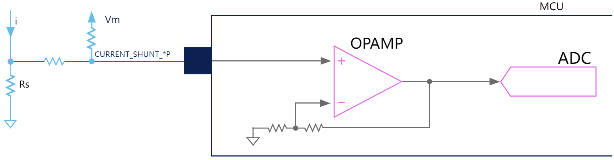 

...2.1、Amplification放大 -> External opAmps外部运放

> Description描述:
>
> Three shunt resistors are used to measure phase currents (one per phase) and the inverter amplifies the voltages measured across the shunts. The signals coming out of the power stage are connected to ADC peripherals on the MCU. The ADCs are in single-ended mode and the three signals carry the potential on the high side of each shunt resistor, which is then compared to the ground of the MCU.
>
> 使用三个分流电阻来测量相电流（每相一个），逆变器会放大分流电阻两端测得的电压。从电源级输出的信号连接到微控制器（MCU）上的模数转换器（ADC）外设。这些ADC工作在单端模式下，三个信号分别携带各分流电阻高侧的电势，随后与微控制器的接地参考点进行比较。

 

...3、Two insulated Current Sensors两个绝缘型电流传感器

> Description描述:
>
> Two Insulated Current Sensors (Hall effect sensors) are used to measure two phase currents (phases U and V) . The signals are connected to ADC peripherals on the MCU. The ADCs are in single-ended mode and the two signals carry the output signals of the Hall sensors. Since only two currents are measured, the third needs to be reconstructed thanks to the iu + iv + iw = 0 relation.
>
> 使用两个**绝缘型电流传感器**（霍尔效应传感器）测量两相电流（U相和V相）。传感器信号连接至MCU的**模数转换器（ADC）外设**。ADC工作于**单端模式**，两路信号分别携带霍尔传感器的输出信号。由于仅测量两相电流，第三相（W相）需通过 $iU+iV+iW=0$ 的电流关系进行重构。

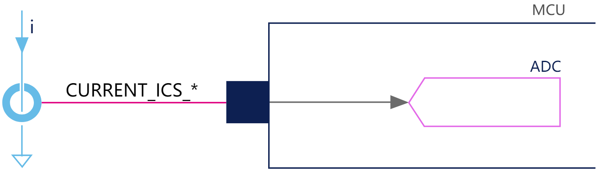 

...4、Three insulated Current Sensors三个绝缘型电流传感器

(1)、Amplifying Network Imax放大网络最大电流：

> Maximum current that is measurable by the current sensing network电流检测网络可测量的最大电流，单位：A

(2)、Amplifying network reference (Vm) 放大网络参考电压：

> Voltage reference of the current sensing network电流检测网络的电压基准，单位：V

(3)、Amplifying Network Power Rating放大网络额定功率：

> Rated power (that can go through the shunt resistor)分流电阻可承受的额定功率，单位：W

(4)、Shunt Resistor分流电阻：

> Shunt Resistor vaue in Ohm分流电阻阻值，单位：Ω

(5)、Op Amp Gain运放增益：

> Gain of the OpAmp amplification运放放大倍数，单位：A

(6)、Polarization Offset偏置偏移量：

> Offset of the Offset network偏移网络的偏移电压，单位：V

(7)、Offset Network Attenuation偏移网络衰减率：

> Gain of the offset network (the circuitry, in front of the OpAmps, that adds a positive offset to the voltage measured accross the shunt resistor).偏移网络增益，指在运放前端电路中为分流电阻测量电压添加正偏移的电路增益，单位：V

(8)、Cut Off Pulse截止频率：

> Low pass filter cutoff pulse in rad/s
> 低通滤波器截止频率，单位：rad/s

(9)、Ics Gain传感器增益：

> Ics是指电流传感器（Current Sensor） 的缩写
>
> Gains of the ICS sensors
>
> ICS传感器增益

在 Tools工具--BoardDesigner电路板设计工程师--Board kind ，选中自建的电机控制板，选择 Share selected board ，将自建的电机控制板导出.zip文件

## 新建工程

以Motor电机 + Inverter控制板构建新工程为例

位置：New project新工程

### 1、General Info通用信息

(1)、Project name工程名称:

(2)、Num. Motors电机个数:

> 1 Motor
>
> 2 Motor

(3)、Driving Algorithm驱动算法:

> FOC
>
> 6-Step

.1、Hardware Mode硬件模式:

(1)、Modular组件

> Choose from collections of Power boards and Control boards as well as the target motor. The Control board, which embeds the Microcontroller, is responsible for processing signals that drive and sense motor spinning. This mode, suitable for easy prototyping, is designed for users who need a highly customizable project configuration.
>
> 从功率板和控制板以及目标电机的集合中进行选择。控制板上包含微控制器，负责处理驱动信号和电机传感器信号。这种模式适合于简单的原型设计，是为需要高度可定制项目配置的用户设计的。

(2)、Inverter电机控制板

> Choose from a collection of all-in-one inverter boards as well as the target motor. The inverter board contains both the control and power components. This mode is meant for users who need space-efficient solutions on a all-in-one board ready to work with a motor.
>
> 从一系列一体化电机控制板以及目标电机中进行选择。电机控制板包含控制和功率组件。这种模式适用于需要在一块可与电机一起工作的一体式板上提供空间高效解决方案的用户。

(3)、Pack电机控制套件

> Choose from a collection of predefined combinations of components provided by Workbench, each containing a control board, power board and motor. These combinations are designed to provide a plug-and-play solution for motor control projects. This mode is meant for users who want a quick and easy setup.
>
> 从Workbench提供的预定义组件组合中进行选择，每个组件都包含一个控制板、功率板和电机。这些组合旨在为电机控制项目提供即插即用的解决方案。此模式适用于希望快速轻松设置的用户。

Description描述:

### 2、Motor电机

选择一个WB自带的电机，复制创建一个备份，根据自己的电机参数进行配置

.1、General Info通用信息

(1)、Name名称:

(2)、Description描述:

.2、Motor parameters电机参数

(1)、Motor magnetic structure电机磁结构:

> 表贴式SM-PMSM
>
> 内置式I-PMSM

(2)、Pole Pairs极对数:

.3、Electrical parameters电气参数

(1)、Max current最大电流 : Apk

(2)、Max DC Voltage最大母线电压 : V

(3)、Rs : Ω

(4)、Ls : mH    (SM-PMSM)

​        Ld : mH    (I-PMSM)

​        Ld/Lq ratio :     (I-PMSM)

(5)、B-Emf constant反电势常数 : Vrms/kRPM

.4、Mechanical parameters机械参数

(1)、Inertia转动惯量 : µN·m·s²

(2)、Friction摩擦系数 : µN·m·s

(3)、Max. Application Speed最高转速 : rpm

.5、Hall Effect霍尔效应

(1)、Sensors displacement传感器分布:

(2)、Placement electrical angle安装电角度:

.6、Quadrature Encoder正交编码器

(1)、Pulses per mechanical revolution每机械转一圈的脉冲数:

(2)、Has index pin (Ch Z)：Z信号

点击确定，创建完成用户自己的电机，保存在软件中，便于下次使用

### 3、Inverter控制板

​    选择需要的Inverter控制板

确定

