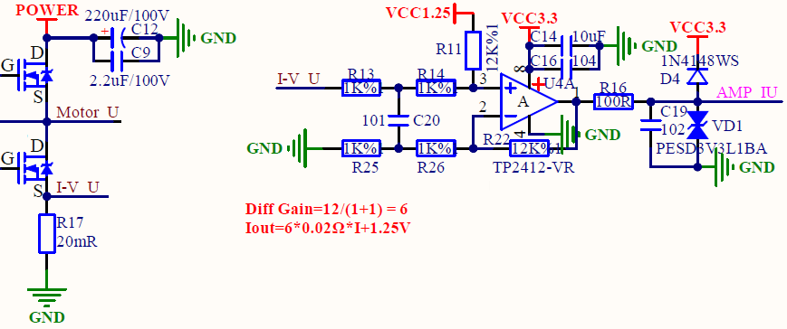
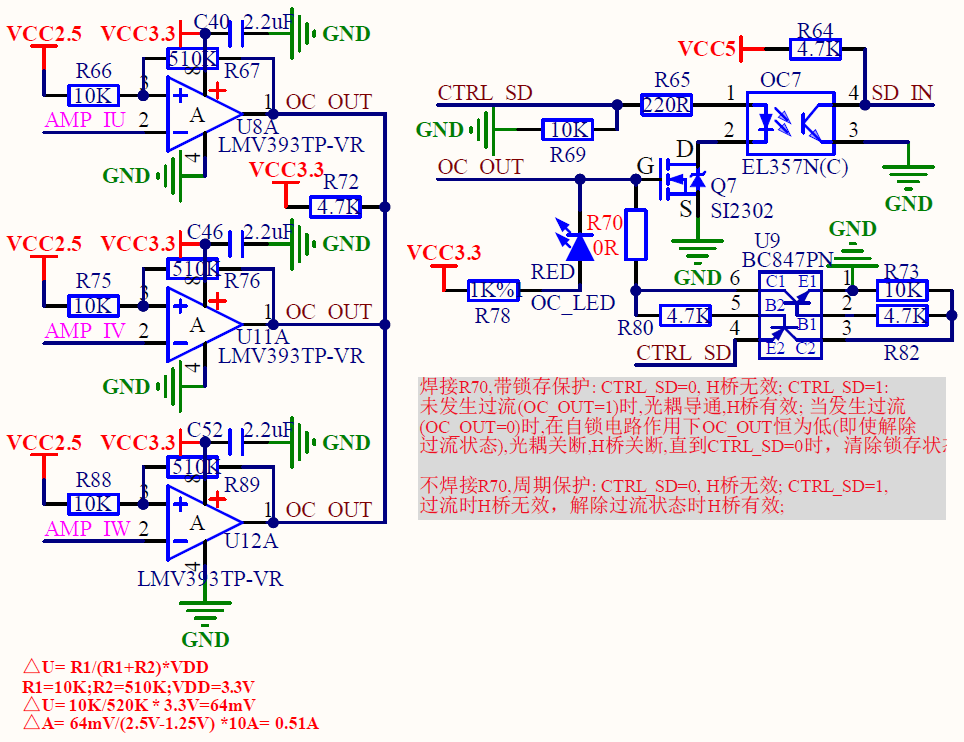
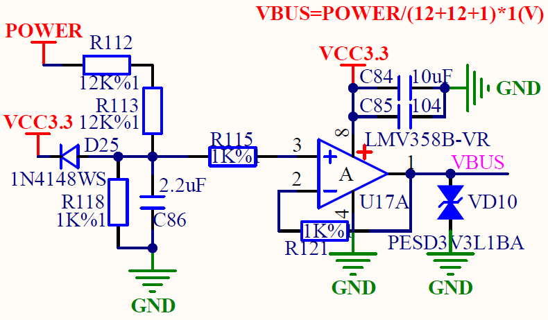
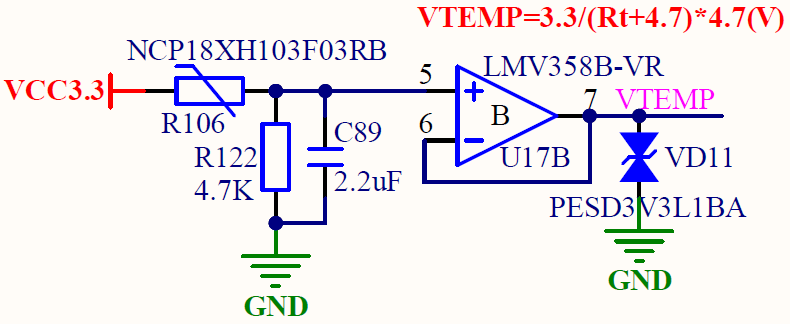
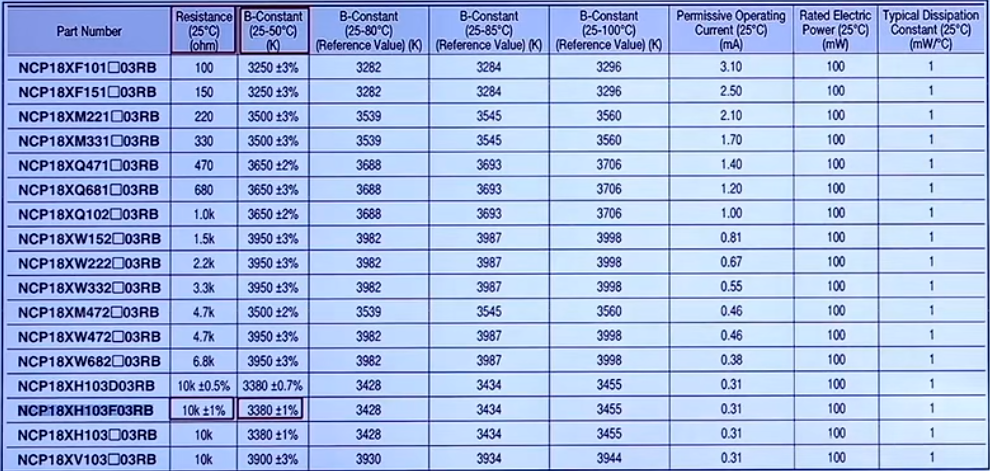
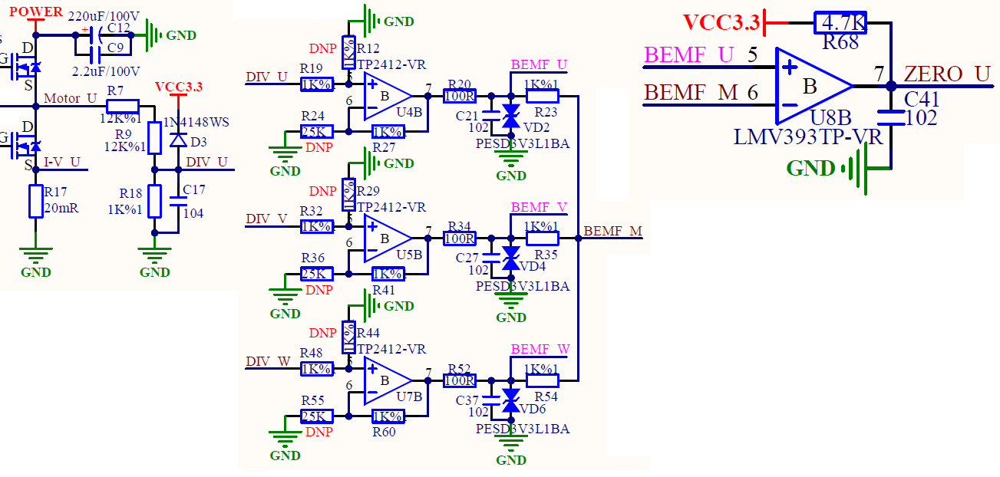
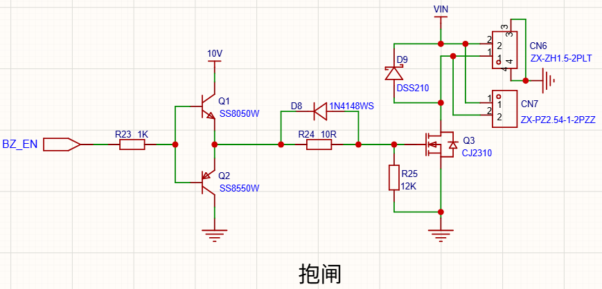

电机驱控板硬件上可分为控制板、功率板。控制板主要是MCU最小系统电路、以及其他低电压等级的外设电路。功率板主要是栅极驱动电路等高电压电路

# 相电流采集

## 模拟电路分析

 

* 电机相电流采样电路
  **R17 20mR**：**电流采样电阻**，当电流流过时，在R17上产生电压 (I-V U = I * 0.02Ω) ，实现 “电流→电压” 转换，用于电流检测。

* 差分放大+信号调理电路
  对采样电压信号做差分放大、偏置与保护，输出可用的电流检测信号（AMP IU）

  * **运放 U4A**：核心放大器件，组成差分放大电路，放大采样得到的 I-V U 信号。
  * **R13、R25（1KΩ）**：**差分输入匹配电阻**，使运放同相 / 反相端阻抗匹配，减少共模干扰。
  * **R14（1KΩ）、R22（12KΩ）**：**放大反馈网络电阻**，决定差分放大的增益。
  * **R11、VCC1.25**：R11 是偏置电阻，VCC1.25 是**参考电压源**，为运放提供稳定的直流工作点（使电路能处理单极性采样信号）。
  * **C14（10uF）、C16（0.1uF）**：**电源滤波电容**，滤除 VCC3.3 的纹波与高频噪声，稳定供电。
  * **D4（1N4148WS）**：**钳位二极管**，保护 AMP IU 输出端，防止电压过高损坏后级负载。
  * **VD1（PESD3V3LBA）**：**ESD 静电保护二极管**，抑制静电放电对输出端的损坏。
  * **R16（100Ω）**：**限流电阻**，限制输出回路电流，保护运放与后级电路。
  * **C19（0.001uF）**：**输出滤波电容**，滤除 AMP IU 信号的高频噪声，使输出更平滑。

  该电路是**简化差分运算放大电路**，增益由反馈电阻与输入电阻的比值决定：

  反馈电阻为 R22=12KΩ

  输入支路的两个匹配电阻为 R13=1KΩ、R14=1KΩ

  **差分放大增益 = 反馈电阻 / 输入支路电阻之和**：Diff Gain = R22 / (R13 + R14) = 12K / (1K + 1K) = 6

  **ADC采集电压 = ADC值 * ADC采集最大电压值 / ADC最大量化等级数** = ADC值 * 3.3V / 4096，(12位ADC的最大量化等级数为 $2^{12} = 4096$)

## 模拟量采集配置

1、电机停机状态

进行ADC采集，得到**电机停机ADC值**，即**偏置值**

2、电机运行状态

进行ADC采集，得到**电机运行ADC值**

3、电机实际采集相电压

AMP_IU实际采集相电压 = (电机运行ADC值 - 电机停机ADC值)  * ADC采集最大电压值 / ADC最大量化等级数 = (电机运行ADC值 - 电机停机ADC值)  * 3.3V / 4096

AMP_IU实际采集相电压 = 差分放大增益 * I-V U电流 * 电流采样电阻 + 参考电压 = 6 * I-V U电流 * 0.02Ω + 1.25V

4、电机实际相电流

I-V U电流 = (AMP_IU实际采集相电压 - 参考电压) / (差分放大增益 * 电流采样电阻) = (AMP_IU实际采集相电压 - 1.25V) / (6 * 0.02Ω)

# 过流检测/保护

## 电路分析

 

# 电源电压采集

## 模拟电路分析

 

通过**电阻分压 + 电压跟随器**的方式实现母线电压（POWER）的采集

1、母线电压的分压处理

母线电压 POWER 是高压信号（需采集的目标电压），通过**电阻分压网络**（R112、R113、R118）将其降低到后续电路可处理的低压范围：

- 分压电阻：R112（12K）、R113（12K）、R118（1K）串联，总阻值为 $R112 + R113 + R118$

- 分压比例：$\frac{R118}{R112 + R113 + R118} = \frac{1K}{12K + 12K + 1K} = \frac{1}{25}$

分压点的电压为 **$分压电压 = POWER * 分压比例$**

2、电压跟随器的缓冲隔离

运放 U17A（LMV358B-VR）被接成**电压跟随器**（同相输入端接分压信号、反相输入端接输出端）：

- 作用：对分压后的低压信号进行**缓冲、隔离**（提高带负载能力，避免分压网络受后级电路影响），且不改变电压大小，因此运放输出端（VBUS）的电压等于分压电压，即**$VBUS = 分压电压$**。

3、辅助电路的作用

- D25（1N4148）：单向导通 / 钳位，防止反向电压干扰分压网络；
- C86（2.2uF）：滤波，平滑分压后的电压信号；
- C84/C85（10uF）：运放电源（VCC3.3）的滤波电容，稳定供电；
- VD10（ESD 二极管）：保护 VBUS 端免受静电干扰。
- R115 (1K)：限流保护/干扰隔离，串联在分压信号与运放同相输入端之间，限制流入运放输入级的电流，避免运放因过流(如尖峰电压干扰)损坏。抑制分压网络与运放输入端之间的电磁/信号耦合干扰，提升信号传输的稳定性。

## 模拟量采集配置

1、母线电压采集

进行ADC采集，得到ADC值

VBUS母线电压采集 = ADC值 * ADC采集最大电压值 / ADC最大量化等级数 =  ADC值 * 3.3V / 4096

VBUS母线电压采集 = 分压电压 = POWER电源电压 * 分压比例

2、电源电压

$POWER电源电压 = 分压电压 / 分压比例 = VBUS母线电压采集 / \frac{1}{25}$

# 温度采集

## 模拟电路分析

 

通过热敏电阻**NTC**的阻值随温度变化，将温度信号转换为电压信号（VTEMP）

* NTC 热敏电阻（R106：NCP18XH103F03RB）：这是**负温度系数（NTC）热敏电阻**：温度升高时，其阻值\(R_t\)会降低；温度降低时，\(R_t\)会升高（实现 “温度→阻值” 的转换）。

* **分压电路（R106 + R122）**：R122 是固定电阻（4.7KΩ），与 R106 串联后由 VCC3.3（3.3V 电源）供电，通过分压将 “阻值变化” 转换为 “电压变化”。
  分压比例：$\frac{R122}{R106 + R122} = \frac{4.7K}{Rt + 4.7K}$

分压点的电压为 **$分压电压 = VCC3.3 * 分压比例$**

*  运放的作用（U17B：LMV358B-VR）
  运放被接成**电压跟随器（缓冲器）**：反相输入端（6 脚）直接接输出端（7 脚），同相输入端（5 脚）接分压电压。

  * 功能：高输入阻抗（不影响分压电路的电压）、低输出阻抗（增强带载能力），让分压电压稳定输出到 VTEMP。

  即分压电压 =  VTEMP

* **滤波电容 C89（2.2uF）**：滤除分压电压的高频噪声，让输入运放的电压更稳定。

* **ESD 保护二极管 VD11（PESD3V3L1BA）**：防止静电（ESD）损坏后续采集电路（如 MCU 的 AD 引脚），静电会通过二极管泄放到 GND。

## 模拟量采集配置

1、温度电压采集

进行ADC采集，得到ADC值

VTEMP温度电压采集 = ADC值 * ADC采集最大电压值 / ADC最大量化等级数 =  ADC值 * 3.3V / 4096

VTEMP温度电压采集 = 分压电压 = VCC3.3 * 分压比例

2、温度电阻

$分压比例 = VTEMP温度电压采集 / 3.3V$

$Rt = 4.7K / 分压比例 - 4.7K$

3、实际温度值

再根据Rt的值，求出对应的实际温度值

实际温度T = 1 / (ln(Rt / R0) / B + 1 / T0)，参照NTC电阻的数据手册

 

 

这里T、T0指的是K度，即开尔文温度

1K度 = 273.15(绝对温度) + 摄氏度

其中，T0：常温 等于273.15 + 25

T：实际温度

Rt：热敏电阻在T温度下的阻值

R0：热敏电阻在T0常温下的标称阻值

B：热敏电阻的重要恒定参数

# 过零点检测

过零点：反电动势从正变化为负或者从负变化为正的点

反电动势过零点都发生在不通电的那一相

## 电路分析

 

# 抱闸

## 电路分析

 
