# 开发环境配置

## 适配 DengFoc_v4

### Arduino IDE 配置

软件版本：Arduino IDE 1.8.19

库文件：SimpleFoc Library 2.2.1    （工具-管理库-搜索）

开发板文件：ESP32 Library 2.0.4    （工具-开发板-开发板管理器-搜索）

ESP32 Library 2.0.4在线安装不起，离线安装：

压缩包放进：C:\Users\HuangChun\AppData\Local\Arduino15\staging\packages

文件-首选项-附加开发板管理器网址：https://espressif.github.io/arduino-esp32/package_esp32_index.json

8个工具：

1、esp32-2.0.4.zip

2、https://github.com/espressif/arduino-esp32/releases/download/2.0.2/esptool-3.3-windows.zip

3、https://github.com/earlephilhower/esp-quick-toolchain/releases/download/3.0.0-gnu12/i686-w64-mingw32.mklittlefs-c41e51a.200706.zip

4、https://github.com/igrr/mkspiffs/releases/download/0.2.3/mkspiffs-0.2.3-arduino-esp32-win32.zip

5、https://github.com/espressif/crosstool-NG/releases/download/esp-2021r2-patch3/riscv32-esp-elf-gcc8_4_0-esp-2021r2-patch3-win32.zip

6、https://github.com/espressif/crosstool-NG/releases/download/esp-2021r2-patch3/xtensa-esp32-elf-gcc8_4_0-esp-2021r2-patch3-win32.zip

7、https://github.com/espressif/crosstool-NG/releases/download/esp-2021r2-patch3/xtensa-esp32s2-elf-gcc8_4_0-esp-2021r2-patch3-win32.zip

8、https://github.com/espressif/crosstool-NG/releases/download/esp-2021r2-patch3/xtensa-esp32s3-elf-gcc8_4_0-esp-2021r2-patch3-win32.zip

参考：https://blog.csdn.net/qq_21049619/article/details/122935550

### PlatformIO (VSCode)

试试非公司WiFi、个人热点、加速器下载

* Board选择：Espressif ESP32 Dev Module
* Simple FOC版本选择：2.2.1
* 开启串口：在 `platformio.ini` 文件后添加

```
upload_port = COM[5]    ;下载端口
monitor_speed = 115200    ;波特率
lib_extra_dirs = ..\..\lib    ;源文件路径，..\表示当前上级目录
```

## 适配STM32电机驱动板

[X-CUBE-MCSDK - STM32电机控制软件开发套件（MCSDK） - 意法半导体STMicroelectronics](https://www.st.com.cn/zh/embedded-software/x-cube-mcsdk.html?icmp=tt6889_gl_lnkon_apr2018)


## 硬件

淘宝：DengFOC_V4电机驱控板    灯哥开源

订单号4003241906851083411


淘宝：STM32F407电机开发板+无刷驱动板+无刷电机PMSM+2.8寸TFT LCD触摸屏    正点原子

订单号4147126380884083411


# 电机控制相关STM32外设及试验

## 基本定时器

​    1、基本定时器中断

## 高级定时器

​    1、高级定时器中断
​    2、高级定时器PWM输出
​    3、高级定时器互补输出带死区刹车控制
​    4、高级定时器输入捕获
​    5、高级定时器PWM输入
​    6、高级定时器输出比较模式
​    7、高级定时器输出指定个数PWM

每一个类型的定时器挖掘出其所有功能，高级定时器不去做低级定时器的功能试验

## ADC

​    1、ADC单通道采集
​    2、ADC单通道采集（DMA读取）
​    3、ADC多通道采集（DMA读取）
​    4、内部温度传感器试验

## DAC

​    1、DAC输出试验
​    2、DAC输出三角波
​    3、DAC输出正弦波

## 直流无刷电机BLDCM

​    1、有感方波驱动（直流无刷电机BLDCM、永磁同步电机PMSM）
​    2、电压温度电流采集
​    3、有感方波驱动 PID 速度环控制
​    4、有感方波驱动 PID 电流环速度环控制
​    5、无感控制
​    6、无感控制 PID 速度环控制
​    7、无感控制 PID 电流环速度环控制

## FOC

​    1、速度开环控制

​    2、位置环控制

​    3、速度环控制

​    4、电流环控制

​    5、电流环速度环控制

​    6、电流环位置环控制

​    7、电流环速度环位置环控制


## 控制与STM32定时器的关系

1. 直流有刷电机控制，常用脉冲宽度调制技术（PWM）来控制电压的大小，以此改变转速。
2. 步进电机控制，接收的脉冲个数决定旋转位置，脉冲频率决定旋转速度。

电机控制本质就是**脉冲控制** ，因此，引入 STM32定时器，以便对脉冲信号实现更高效的控制。


# FOC闭环位置控制

FOC闭环位置控制的本质

怎么让电机从偏差位置旋转到期望位置？

* 设定 期望位置
* 识别 偏差位置
* 计算 旋转力矩(等效为 $Uq$ )
* 运行 电机从偏差位置 旋转到 期望位置

**本质**：怎样检测角度偏差位置，及怎样产生合适的旋转力矩


## PID中P环的纠偏原理

系数 $K_p$ ：PID的P控制器系数 (让电机在误差位置 $e$ 时产生最大回正力矩)
$$
K_p = \frac{ \lvert U_{qmax} \rvert }{ \lvert e \rvert }
$$

> 其中， $U_{qmax} = \pm \frac{电机输入电压}{2}$ (将三相电压曲线移动到供电电压中央，所以这里 最大可设定电压 = 输入电压 / 2 )
>
> $ 误差位置e = 期望位置 - 偏差位置 $ ，设逆时针旋转方向为负，顺时针旋转方向为正，电机的误差位置为 $e$ ，单位：度(°)


根据误差位置 $e$ 求出 $Uq$ 
$$
U_q = K_p e
$$

> 其中， $K_p$ 由最大力矩限制计算
>
> $e$ 由编码器测得电机转子角度 (AS5600编码器)


> PID位置控制器
>
> 电机力矩输出公式：
> $$
> U_q = K_p e(t) + K_i \int_0^t e(\tau) d \tau + K_d \frac{d e(t)}{dt}
> $$
> 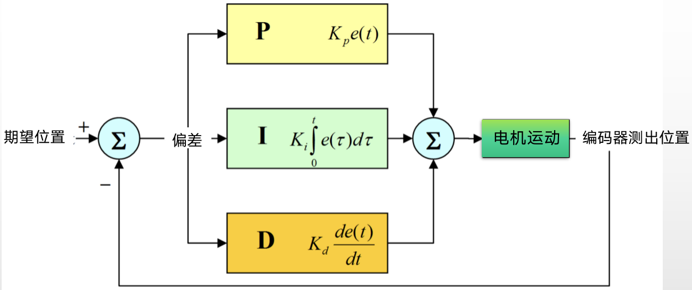


## FOC闭环位置思路

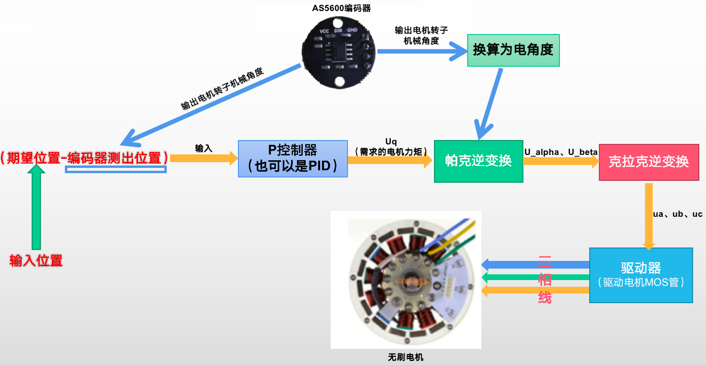

> **注意**：以上为FOC闭环位置控制的最基础方式：位置环——力矩环 控制
>
> 还有其他方式：位置环——速度环——力矩环
>
> 。。。

编码器反馈角度


# FOC 闭环速度控制算法

可单独作为一个功能使用，用于需要精确控制速度的场合；

也可用于 位置环——速度环——力矩环


## FOC闭环速度思路

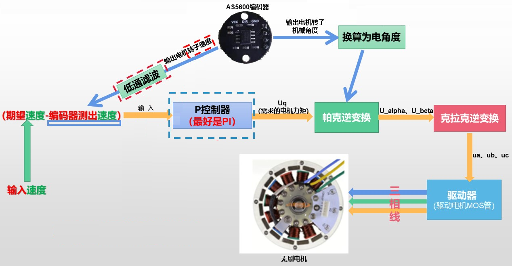

编码器反馈速度


### 编码器获取角度值

```c++
// 编码器获取角度值
void Sensor_AS5600::Sensor_update() {
    float val = getSensorAngle(); //调用函数getSensorAngle()，获取传感器的角度，赋值给 val
    angle_prev_ts = micros(); //调用函数micros()，获取当前时间戳(单位微秒)，赋值给 angle_prev_ts
    //计算当前角度val与上一次角度angle_prev的差值，赋值给 d_angle，表示角度的变化量
    float d_angle = val - angle_prev; 
    // 圈数检测
    //通过函数abs()，获取角度变化量的绝对值，与80%的360°进行比较，大于则认为发生了一圈的变化。
    //若d_angle >0，表示顺时针旋转，将full_rotations减1；若d_angle <0，表示逆时针旋转，将full_rotations加1。
    if(abs(d_angle) > (0.8f*_2PI) ) full_rotations += ( d_angle > 0 ) ? -1 : 1; 
    //将当前的角度val赋值给变量angle_prev，以备下一次更新状态时使用。未超出一圈的部分也放在angle_prev里
    angle_prev = val; 
}
float Sensor_AS5600::getAngle(){
    //计算输出角度，将圈数full_rotations转换成弧度值，加上未转满一圈的部分
    return (float)full_rotations * _2PI + angle_prev;
}
```


### 编码器获取速度

(本时刻的角度值-上时刻的角度值)/走过这段角度经过的时间

```c++
// 编码器获取速度
float Sensor_AS5600::getVelocity() {
    // 计算采样时间
    //上一次角度的时间戳angle_prev_ts减去上一次速度角度的时间戳vel_angle_prev_ts，结果乘以1e-6获得秒级的采样时间。
    float Ts = (angle_prev_ts - vel_angle_prev_ts)*1e-6;
    // 快速修复奇怪的情况（微溢出）
    if(Ts <= 0) Ts = 1e-3f;
    // 速度计算 (本时刻的角度值-上时刻的角度值)/走过这段角度经过的时间
    //计算总的角度差值=转过的圈数的差值(full_rotations - vel_full_rotations)乘以2π，加上当前角度和上一次速度角度之间的差值(angle_prev - vel_angle_prev)。最后，将这个总的角度差值除以采样时间Ts，得到速度。这也正是为什么需要求运行每个loop之间，也就是每次读取传感器值之间的时间的原因。
    float vel = ( (float)(full_rotations - vel_full_rotations)*_2PI + (angle_prev - vel_angle_prev) ) / Ts;    
    // 保存变量以待将来使用
    vel_angle_prev = angle_prev;//将当前角度angle_prev赋值给上一次速度角度vel_angle_prev，以备下一次计算速度时使用。
    vel_full_rotations = full_rotations;//将当前转过的圈数full_rotations赋值给上一次速度转过的圈数vel_full_rotations，以备下一次计算速度时使用。
    vel_angle_prev_ts = angle_prev_ts;//将当前角度的时间戳angle_prev_ts赋值给上一次速度角度的时间戳vel_angle_prev_ts，以备下一次计算速度时使用。
    return vel;//返回该计算得到的速度
}
```


### 低通滤波

不进行滤波的速度会存在波动、干扰，电机会发出“吱吱吱”的声音，影响电机控制的效果，引起电机震荡。

低通滤波器的作用

将有波动、干扰的速度信号，经滤波后转化为平滑的速度信号

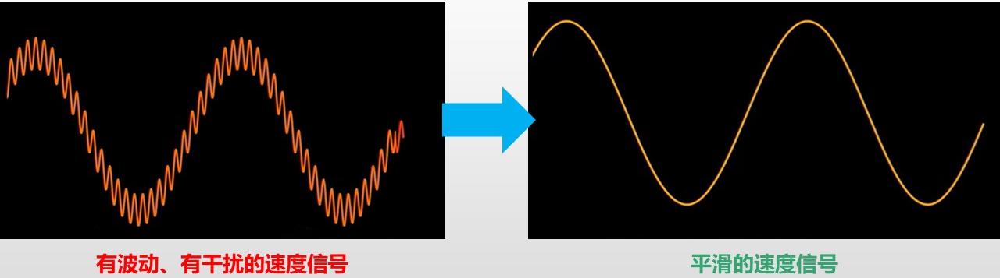


```c++
float LowPassFilter::operator() (float x)
{
    // 计算两次循环的时间间隔，转换为 (秒)
    unsigned long timestamp = micros(); //使用函数micros()获取当前的时间戳(单位微秒为)，赋值给timestamp，表示当前的时间戳。
    float dt = (timestamp - timestamp_prev)*1e-6f; //计算两个时间戳之间的时间差，结果乘以1e-6以转换为秒，赋值给dt，表示时间间隔。

    if (dt < 0.0f ) dt = 1e-3f; //若时间间隔dt小于0，将其设置为1e-3秒(即0.001秒)
    else if(dt > 0.3f) {
        y_prev = x;
        timestamp_prev = timestamp;
        return x;
    } //若时间间隔dt大于0.3秒，即输入信号的采样间隔过大，直接返回当前的输入信号x，并赋值给y_prev，而不考虑进一步滤波了，因为此时，进一步滤波也没意义了，采用之前的值来修正这次的值，但是之前的值和现在的值隔得太久，所以已经废了不能用了，最后，程序同时更新时间戳timestamp_prev。
    // 低通滤波的函数
    float alpha = Tf/(Tf + dt); //计算滤波器的平滑因子alpha。其中Tf是滤波器的时间常数，和要滤波的频率有关，dt是时间间隔。通过将Tf除以Tf + dt，可以获得一个介于0和1之间的值，用于平衡前一次的滤波结果和当前输入信号。
    //目的是根据时间常数和时间间隔的比例来控制滤波器对当前输入信号和前一次滤波结果的加权比例。
    //当时间间隔 dt 远小于时间常数 Tf 时，dt ≈ 0，alpha ≈ Tf / (Tf + 0) ≈ 1。这意味着滤波器主要依赖于前一次的滤波结果，当前输入信号的影响较小。
    //当时间间隔 dt 远大于时间常数 Tf 时，dt ≈ ∞，alpha ≈ Tf / (Tf + ∞) ≈ 0。这意味着滤波器主要依赖于当前的输入信号，前一次的滤波结果的影响较小。
    float y = alpha*y_prev + (1.0f - alpha)*x; //使用平滑因子alpha对上一次的滤波结果y_prev和当前输入信号x进行比例融合，比如，当alpha=0.8时候，意味着这次的滤波输出值取80%的之前值，以及20%的当前值，加起来之后融合输出。所以其实低通滤波的原理就是通过确定之前的值取多少比例，以及当前的值取多少比例来确定的。当之前的值取得多，那么意味着当前时刻的滤波输出值和之前的值变化不大，因此造就了所谓“平滑”，但是也就造就了系统实时跟随现在的信号的能力会被减弱，当当前的传感器值取得多的时候，虽然意味着系统跟随实时信号的能力增强，但是也更容易造成数据不平滑，特别是当当前的值与前一次的值有很大差值的时候！这就是低通滤波器的基本原理。
    y_prev = y; //将当前的滤波结果y赋值给变量y_prev，以备下一次滤波使用。
    timestamp_prev = timestamp; //将当前的时间戳timestamp赋值给变量timestamp_prev，以备下一次滤波使用。
    return y; //将滤波结果y返回给调用该函数的地方
}
```


### 速度环PI控制器

速度环P控制器的缺陷

> 假设电机1和电机2分别负载500g和10g的重物，都顺时针旋转，目标转速10rad/s，当前转速为5rad/s，计算得到输出力矩是 5Kp，电机1和电机2获得一样的输出力矩。
>
> 但是电机1和电机2的惯性不一样，电机1比电机2难加速的多。
>
> 在不同负载下，仅有P环调节，会使电机的稳定效果不一样，大负载时稳定速度变慢，小负载时稳定速度变快。
>
> 理想的调节方式，是根据不同负载情况，自适应进行力矩输出。


I环实际上就是由一个系数Ki和一个对误差在时间上进行不断积分的积分项组成

> $K_i \int_0^t e(\tau) d \tau$
>
> 其中，Ki 称为反馈系数
>
> 当 $e(\tau)$ 误差存在的时间越长，积分值就越大，直到 $e(\tau)$ 变位0为止
>
> 最后，积分*Ki，对Ki进行比例缩放后叠加在电机力矩上


### PID 控制器函数

```c++
// PID 控制器函数
float PIDController::operator() (float error){
    // 计算两次循环中间的间隔时间
    unsigned long timestamp_now = micros();
    float Ts = (timestamp_now - timestamp_prev) * 1e-6f;
    if(Ts <= 0 || Ts > 0.5f) Ts = 1e-3f;
    
    // P环
    float proportional = P * error;
    // Tustin 散点积分（I环）
    //使用Tustin变换的离散积分公式，将上一次的积分输出integral_prev与积分系数I、采样时间Ts以及当前误差值error和上一次误差值error_prev的平均值(也就是上式中的0.5)相乘，得到积分输出integral。
    //离散的积分可以看成很多个小矩形组合在一起求面积，因此，Ts就是相当于离散积分的x轴长度，0,5f*(error+error_prev)就是积分小矩形的高度，这个高度通过两次误差的平均值得到。
    //最后，乘上积分系数I（也就是所谓的Ki），就可以得到本次循环中的积分值，再把这个值加到上一次的积分值integral_prev中，就能够得到总的积分值integral.这就是积分器的原理
    float integral = integral_prev + I*Ts*0.5f*(error + error_prev);
    integral = _constrain(integral, -limit, limit);
    // D环（微分环节）
    float derivative = D*(error - error_prev)/Ts;

    // 将P,I,D三环的计算值加起来
    float output = proportional + integral + derivative;
    output = _constrain(output, -limit, limit);

    if(output_ramp > 0){
        // 对PID的变化速率进行限制
        float output_rate = (output - output_prev)/Ts;
        if (output_rate > output_ramp)
            output = output_prev + output_ramp*Ts;
        else if (output_rate < -output_ramp)
            output = output_prev - output_ramp*Ts;
    }
    // 保存值（为了下一次循环）
    integral_prev = integral;
    output_prev = output;
    error_prev = error;
    timestamp_prev = timestamp_now;
    return output;
}
```


## FOC闭环速度代码

见Arduino程序


# FOC 闭环电流控制算法

使用 电流传感器 的电流输出，计算转换为力矩值，进行力矩闭环


## 闭环电流控制原理

电流力矩的闭环

```c++
Uq=PID(I_q_ref-I_q)
```

> 其中，I_q是传感器观测的电机q轴电流（观测力矩）
>
> I_q_ref是我们的期望q轴电流（期望力矩）
>
> 当(I_q_ref-I_q)<0时，证明实际力矩大于期望力矩，此时Uq会变小，电机输出力会变小；反之，当(I_q_ref-I_q)>0时，证明实际力矩小于期望力矩，此时Uq会变大，电机输出力会变大，在有反馈的情况下，电机最能够稳定在设定的力矩之中！这就是电流闭环的原理！


## 电流传感器 原理

每根相线上串联一个采样电阻和接入一个电流传感器。[欧姆定律] 检测每根相线上的电流值。

INA240A2电流传感器，传递给单片机的是电压值，因为单片机的IO引脚的ADC功能(数模转换)只能识别电压值而不能识别电流值。

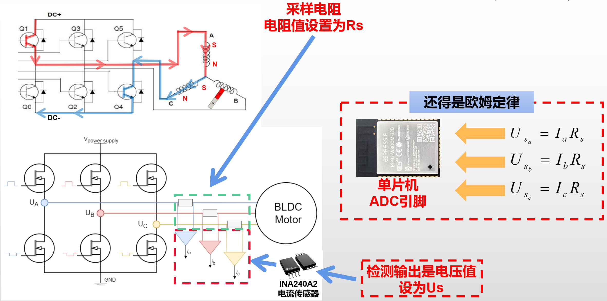

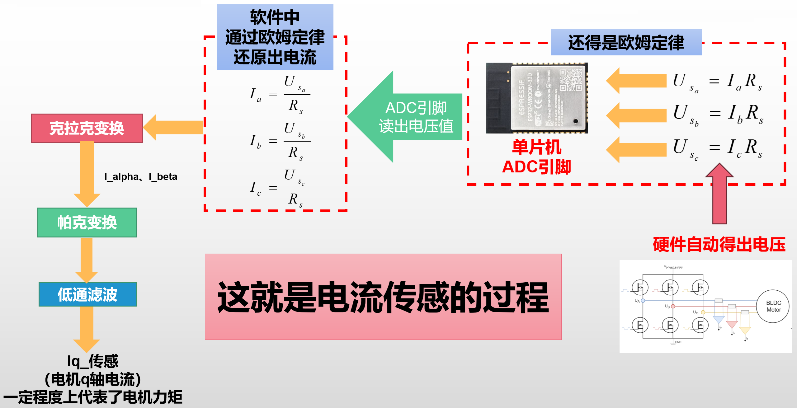

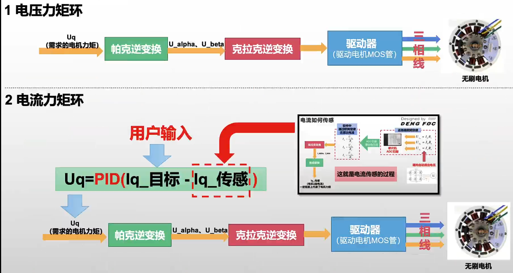


## FOC闭环电流代码

在硬件上，DengFOC 的ESP32单片机只能读取到电压信号

ESP32 ADC引脚测出的数值正是欧姆定律中的U，因此，我们只需要知道R即可完成电压到电流的转化

R=采样电阻=0.01欧姆

由于INA240A2将检测到的电流值放大了50倍

修正后的电流求解公式
$$
I=\frac{U}{50*R}
$$


1.电机原理及其控制概述


# 左手定则

判断导线在磁场中受力方向

伸开左手, 使大拇指与其他四指垂直且在一个平面内, 让磁感线从手心流入, 四指指向电流方向, 则大拇指指向安培力方向(即导体受力方向). 

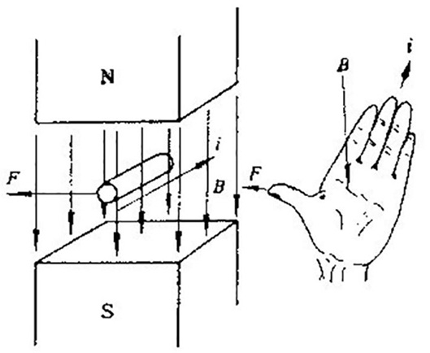 

# 右手定则

判断导线在磁场中感生电动势方向

伸开右手, 使大拇指与其他四指垂直且在一个平面内, 让磁感线从手心流入, 大拇指指向导体运动方向, 则其他四指指向感生电动势的方向. 即切割磁感线的导体会产生反电动势, 而通过反电动势定位转子位置是普通无感电调工作的基础原理之一. 

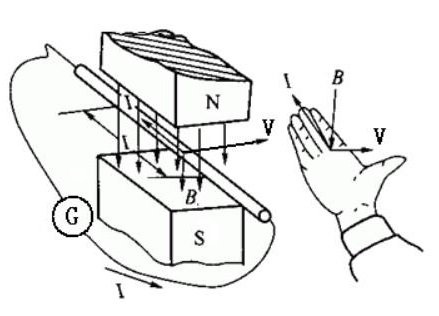 

把电机的三相线合在一起, 用手去转动电机会发现阻力非常大, 因为在转动电机过程中产生了感生电动势, 从而产生电流, 磁场中电流流过导体又会产生和转动方向相反的力,就会感觉转动有很大的阻力. 

 电机三相线分开可轻松转动                                   电机三相线合并转动阻力很大
             

# 右手螺旋定则(安倍定则)

判断通电线圈的极性

用右手握螺线管, 四指弯向螺线管中电流方向, 则大拇指指向螺线管的N极. 

直线电流的磁场: 大拇指指向电流方向, 则其他四指弯向磁感线的方向. 

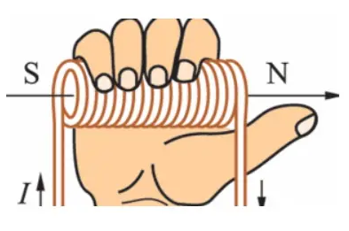 


# 电机的基本结构

电机可以分为定子和转子两部分。

* 定子：线圈绕组，固定不动；
* 转子：旋转部分，输出转速和力矩。

内转子无刷电机、外转子无刷电机


# 电机驱动的基本原理

 根据磁极异性相吸同性相斥的原理, 中间永磁体在两侧电磁铁的作用下会被施加一个力矩并发生偏转. 

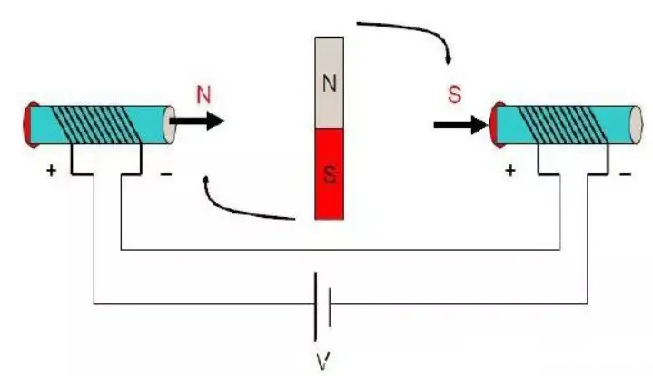 

当改变电机定子线圈的电流交变频率和波形，在定子周围产生磁场，驱动转子永磁体转动，进而带动电机旋转。


# 驱动电机的重点

是研究如何改变定子线圈的电流交变频率和波形。

分为两个部分：

## 硬件电路

无刷电机与有刷电机的区别，是无刷电机没有电刷。不能采用机械结构进行电流的换向。而是通过采用MOS这样的器件进行电子换向。

MOS本质上可理解为一种开关，控制电流的通断。

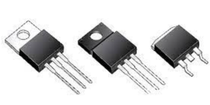 

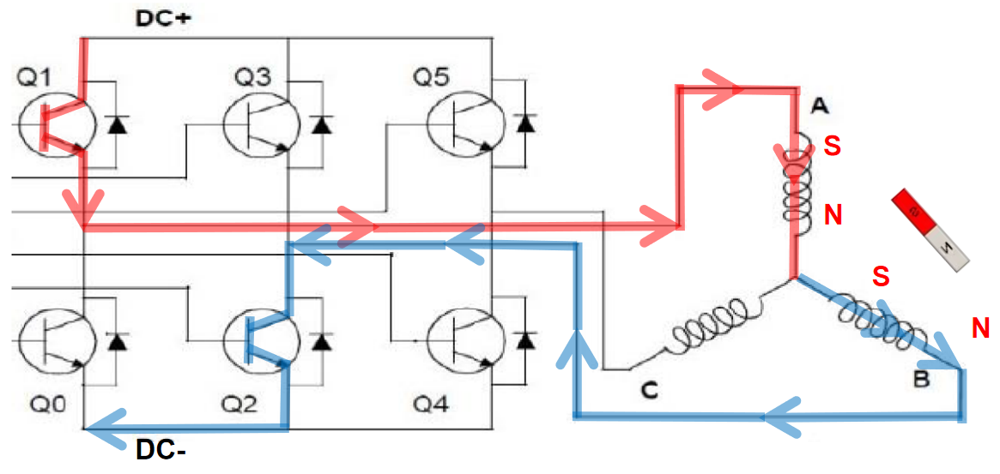

通过控制不同MOS管的通断组合，就能改变电机线圈电流的大小和方向。


定子的三相绕组有**星形联结**和**三角联结**两种方式, 分析常用的三相星形联结的二二导通方式:

无刷电机三相的连接方式是**每一相引出导线的一头, 而另一头和其他相两两相连.** 


* 怎么让转子偏转？

  打开Q1管和Q2管,电流的方向由A相流向B相，根据右手螺旋定则可判断线圈的磁场极性分布，转子受电磁场作用偏转。

* 转子处于什么位置时受到的力矩最大呢? 

  与CO(O为中心点) 连线平行时, 磁铁会受到A、B两个磁极的**一推**和**一拉**的作用, 此时，转子受到的力矩最大。直到偏转到与AB连线平行且磁铁内部磁力线方向与AB间磁力线方向一致时, 转子受到合力矩为0且稳定. 

  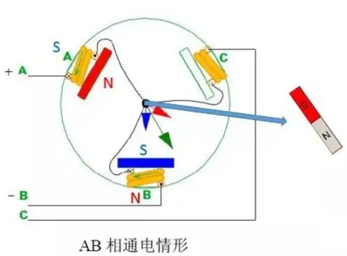 

​		必须改变电磁场的状态才能使转子继续偏转。

* 怎么让转子继续旋转嫩？

  只需要交替的开关不同的MOS管，就可以交替改变定子线圈的电磁场磁极，**这就是无刷电机旋转运动的原理**


转子磁体旋转一周时各个相的通电情况, 共进行6次换相, 每个状态相隔60° 。

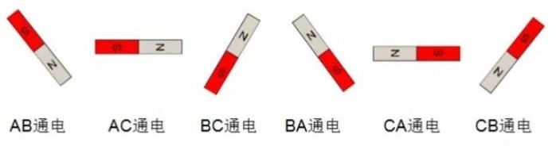 

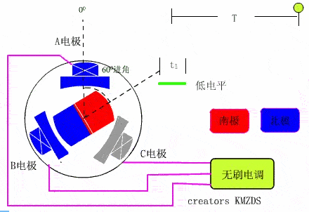  

只要交替的开关各个相的MOS管，就能实现电机的旋转。

当MOS管的开关速度变快，换相的频率就变快，转子的旋转速度就变快，反之，转子的旋转速度就变慢。

电机的电压和KV值决定了电机转速。


总结：**对电机的控制实际上是对MOS管开关规律的控制**

而MOS管的开关规律需要用到单片机程序进行控制，因此就引出了**FOC控制算法**


## 软件控制 (FOC 控制算法)

是对电机运动进行抽象化和简化成数学模型，进而有规律的通过程序控制各个MOS管的开关和通断的过程。


# BLDC和PMSM的区别

​    无刷电机可分为**无刷直流电机(BLDC, 一般用于航模) **和**永磁同步电机(PMSM) **, 结构大同小异, 主要区别在于制造方式 (线圈绕组方式) 不同导致的一些特性差异( 比如反电动势的波形) . 

由于转子在磁场中只有6个稳定的状态，因此旋转过程其实是不平滑的，存在扭矩的抖动（没有通电的时候可以用手转一下无刷电机，会感受到这种“颗粒感”）。

BLDC的反电动势接近梯形波，肯定会有上面说的抖动问题，但是转一圈抖6下太明显了，如果增加电机槽、极对数（也就是磁铁对数），那以前是360度里面抖6下，现在变成120度里面抖6下，甚至更小，这样“颗粒感”不就变得更小了嘛？实际中买到的BLDC电机基本都是**多极对**的。

PMSM的反电动势接近**正弦波**，用**软件和算法**结合**PWM技术**将方波转变成等效的SPWM正弦波或者SVPWM马鞍波，再来驱动电机


什么是磁极相位角?

​	是指编码器安装时的物理偏移角度。它与电机动力线缆连接相序、编码器等相关。当更换编码器或者更改电机动力线缆连接相序后，需重新设定此参数。

​	每个电机轴在试运行前都必须正确设置“磁极相位角”。


如何检测磁极相位角？

01、“常规检测方法”

​	适用场景：电机未安装到机械设备，如电机未安装机器人本体。

​	注意事项：检测过程中需要转动电机轴。

02、“静态检测方法”

​	应用场景：电机已安装到机械设备且电机带抱闸，如电机已安装到机器人本体。

​	注意事项：检测过程中电机轴保持静止状态，检测前需设置静态磁极相位角检测相关参数。开始可先使用默认值，如测试不通过，可适当调整。


# 正弦脉宽调制 `SinePWM`

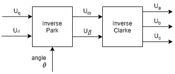 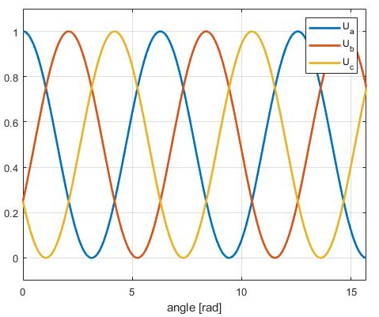

* 帕克逆变换： $U_q$ 、$U_d$ 、$\theta$  经 **帕克逆变换** 求得 $ U_{\alpha}$ 、 $ U_{\beta}$  ；

* 克拉克逆变换：  $ U_{\alpha}$ 、 $ U_{\beta}$  经 **克拉克逆变换** 求得  $U_a$ 、$U_b$ 、$U_c$ ；

  经驱动器 控制MOS管的通断 ，实现电机的旋转。
  代码如下：

  ```c++
  void BLDCMotor::setPhaseVoltage(float Uq, float angle_el) {
      // SPWM调制 
  
      // 角度在0和360°之间的归一化
      // 仅当使用_sin和_cos近似函数时才需要
      angle_el = normalizeAngle(angle_el + zero_electric_angle);
      // 帕克逆变换
      Ualpha =  -_sin(angle_el) * Uq;
      Ubeta =  _cos(angle_el) * Uq;
  
      // 克拉克逆变换
      Ua = Ualpha + voltage_power_supply/2;
      Ub = -0.5 * Ualpha  + _SQRT3_2 * Ubeta + voltage_power_supply/2;
      Uc = -0.5 * Ualpha - _SQRT3_2 * Ubeta + voltage_power_supply/2;
  
      // 给硬件设定电压
      setPwm(Ua, Ub, Uc);
  }
  ```

