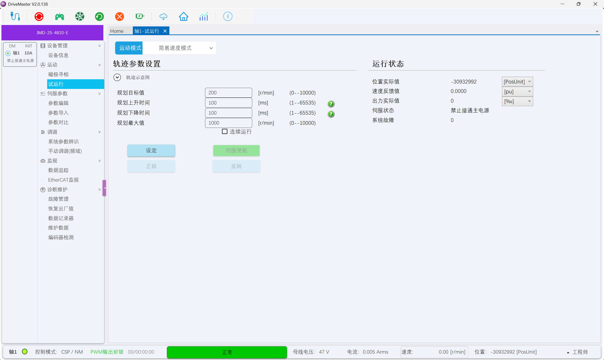
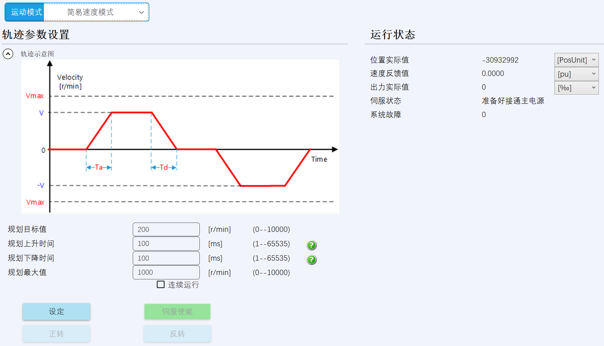
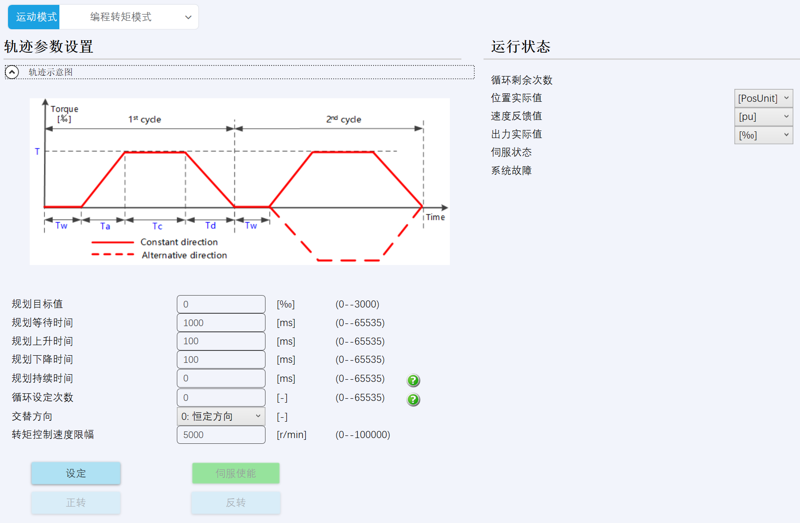
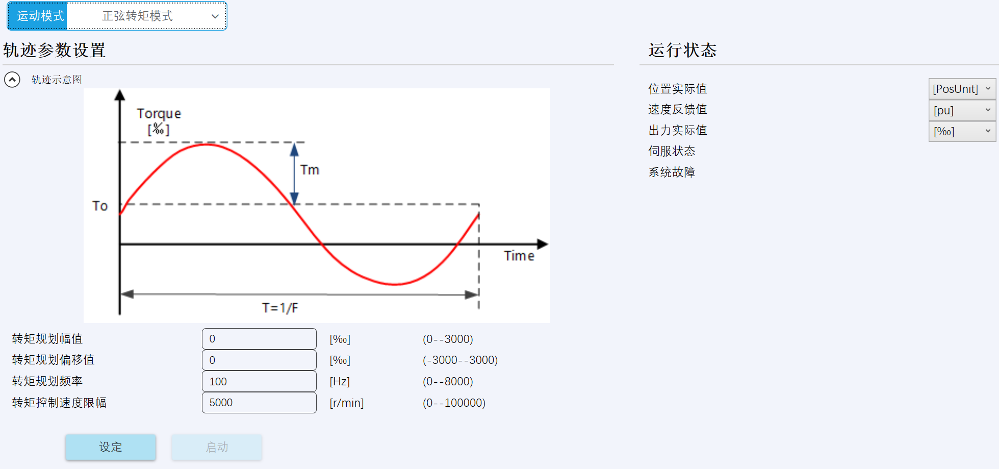
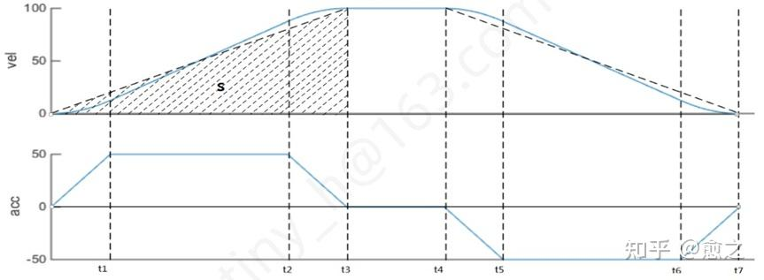
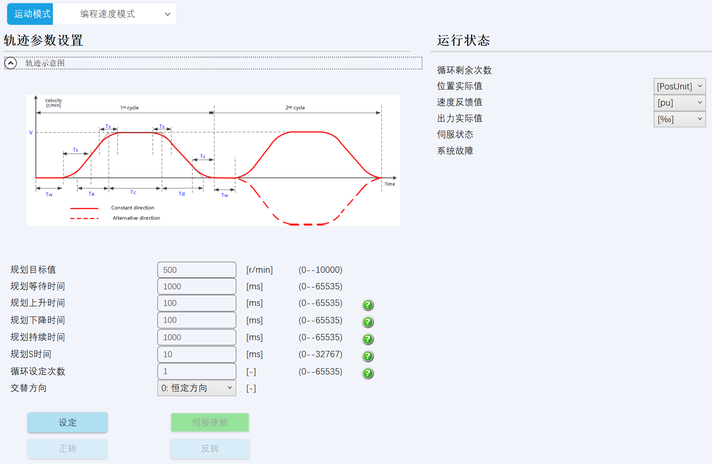
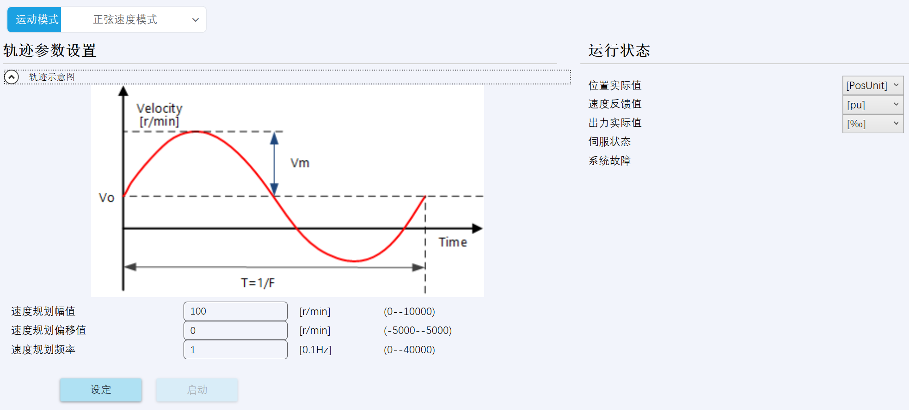
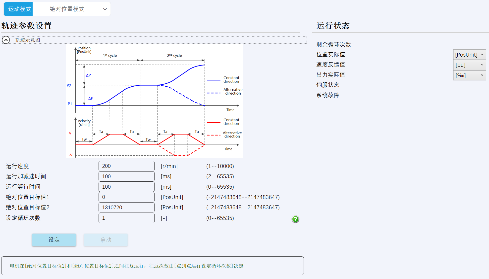
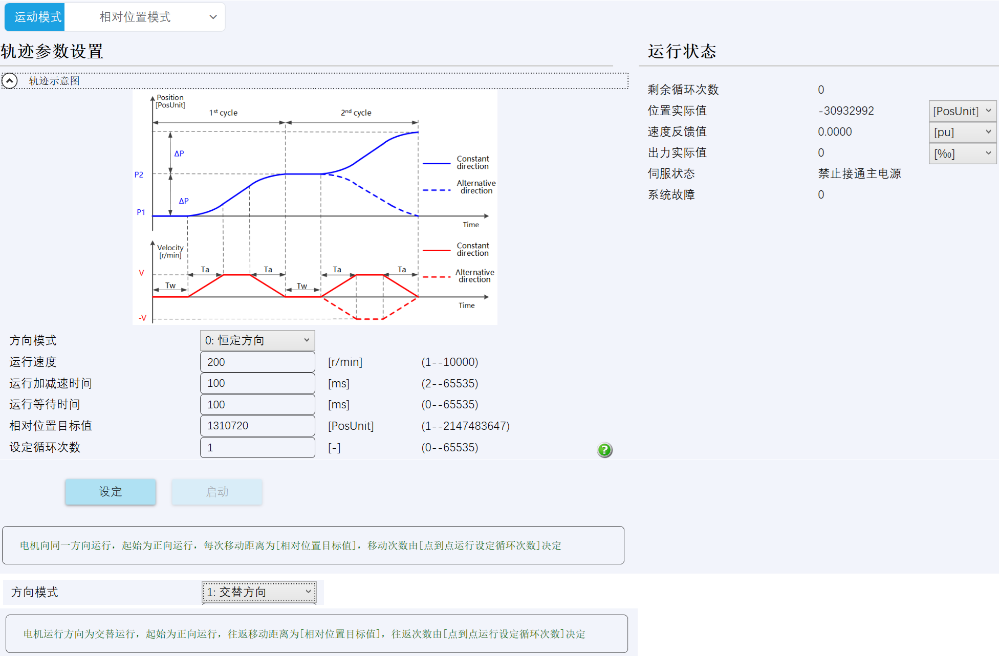

在状态栏中显示**母线电压**、**电流**、**速度**、**位置**

 

# 运动调试模式

闭环模式下除了显示以下各环PID相关参数外，还需显示**位置实际值**、**速度反馈值**、**出力实际值**

## 1、电流环

以**目标力矩**保持在**设定电角度**

设定值：electrical_angle

> (可设定、or由编码器反馈。当设定时，电机将在设定电角度保持；当由编码器反馈，电机将以目标力矩旋转)

iqPID：

设定值：Target、Kp、Ki、Kd、OutMax、OutMin

反馈值：Actual、Out

idPID：

设定值：Target、Kp、Ki、Kd、OutMax、OutMin

反馈值：Actual、Out

## 2、速度环

以**目标速度**、**目标力矩**运动 (速度-电流环)

velocityPID：

设定值：Target、Kp、Ki、Kd、OutMax、OutMin

反馈值：Actual、Out

## 3、位置环

以**目标速度**运动到**目标位置** (位置-速度-电流环)

~~以**目标力矩**运动到**目标位置** (位置-电流环，此时速度环PID设为0即可)~~

AnglePID：

设定值：Target、Kp、Ki、Kd、OutMax、OutMin

反馈值：Actual、Out

## 4、电流开环

以**设定电流**保持在**设定电角度**

设定值：Uq、Ud、electrical_angle

## 5、速度开环

以**设定速度**、**设定力矩**运动

设定值：target_velocity、Uq、Ud

## 6、位置开环

以**设定速度**运动到**设定位置**

设定值：target_angle、target_velocity、Uq、Ud

# 试运行

## 1、简易速度模式

 

## 2、编程转矩模式

 

## 3、正弦转矩模式

 

## 4、编程速度模式

 

## 5、正弦速度模式

 

## 6、绝对位置模式

 

## 7、相对位置模式

 